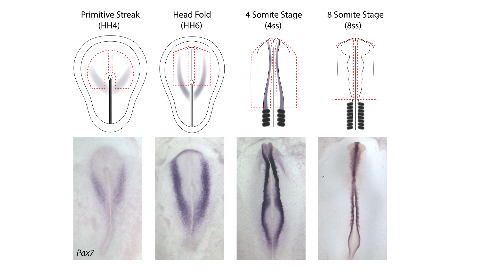
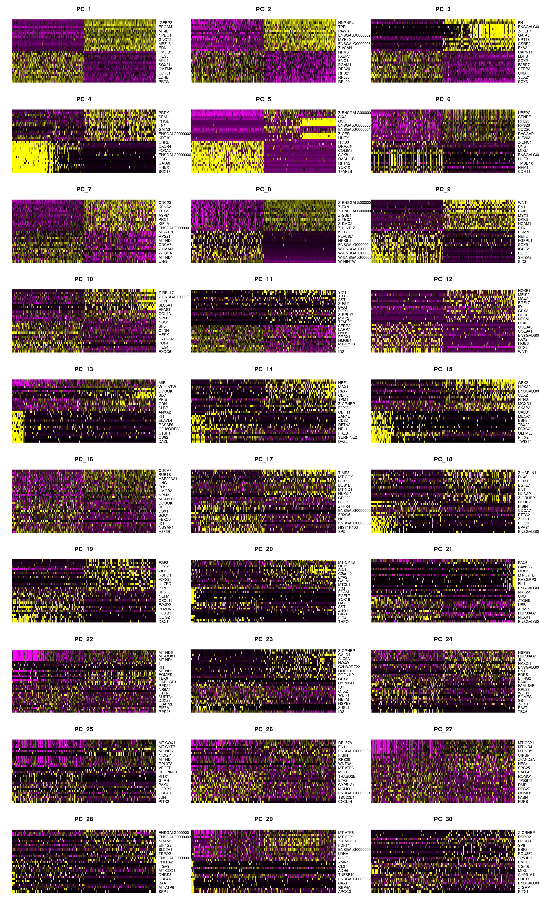
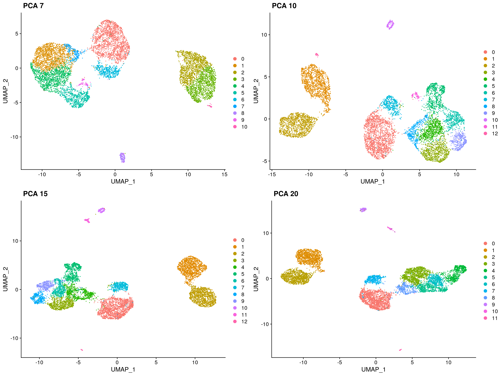
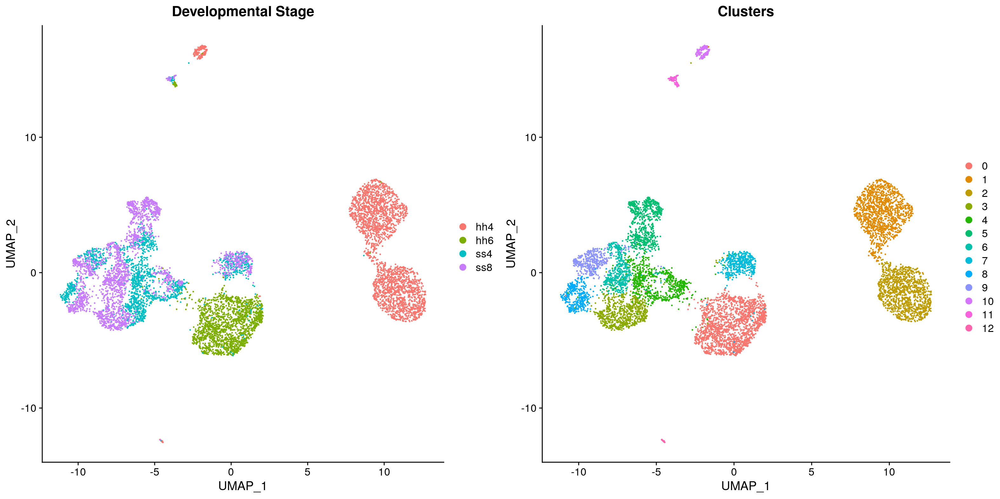
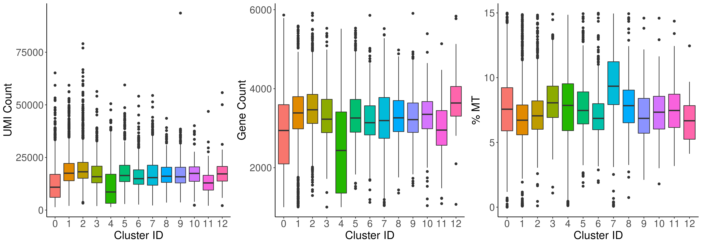

# Chick 10x Neural Development

<p align="center">



</p>

This repository provides the code to run the 10x single cell RNA-eq analysis.


- [Data availability](#data-availability)
- [Analysis pre-requisites](#analysis-pre-requisites)
- [Docker](#docker)
- [Nextflow](#nextflow)
- [Interactive downstream analysis](#interactive-downstream-analysis)
- [Downstream analysis pipeline](#downstream-analysis-pipeline)

#
## Data availability
#
This repository contains the required code to run the entire alignment and downstream analysis pipeline. For those who would like to re-run the analysis, the following files should be downloaded:

- to run the analysis including the alignment, the raw fastq sequencing files can be found [here]().
- to run the downstream analysis from the UMI counts generated from 10x Genomics Cell Ranger are embedded can be found within the repository [here]("./alignmentOut/cellrangerCounts_renamed").

#
## Analysis pre-requisites
#
The pipeline is run using Nextflow and Docker to ensure reproducibility. The repository can be called directly from GitHub, so to re-run the analysis you just need to install [Nextflow](https://www.nextflow.io/docs/latest/getstarted.html#installation) and [Docker](https://docs.docker.com/get-docker/).

If you are wanting to run the downstream analysis interactively outside of Nextflow, you still need to download Docker and you will also need to download this repository.

#
## Docker
#
Docker allows us to run our analysis through a container with all required libraries and dependencies. This ensures cross-platform reproducibility of our results.

The docker image used can be found [here](https://hub.docker.com/r/alexthiery/10x_neural_tube)

We have also included Rstudio within our docker image to allow you to run the downstream analysis interactively if you wish - for details on how to do this click [here](#interactive-downstream-analysis).

#
## Nextflow
#
You can easily re-run our entire pipeline in Nextflow using the following steps:
1) Install Nextflow and Docker
2) Download chick genome ([galgal6](http://ftp.ensembl.org/pub/release-97/fasta/gallus_gallus/dna/Gallus_gallus.GRCg6a.dna.toplevel.fa.gz))
3) Download annotation gtf ([galgal6](http://ftp.ensembl.org/pub/release-97/gtf/gallus_gallus/Gallus_gallus.GRCg6a.97.gtf.gz))
2) Download raw reads from [here]()
3) Make a sampleInfo.csv file containing the sample names and corresponding paths using this [template](sampleInfo.csv)
4) Run Nextflow using the following command

``` sh
nextflow run alexthiery/10x_neural_tube \
-profile docker \
--metadata <path to sampleInfo.csv> \
--gtf <path to gtf> \
--fa <path to genome>
```

This pipeline is configured to be ran on a cluster with 224GB memory and 32CPUs by default. The `-profile` flag can be used to set  either 'docker' or 'singularity', depending on the container application installed on your system. These settings can be adjusted  by replacing the `-profile` flag with a custom config file as below.

``` sh
nextflow run alexthiery/10x_neural_tube \
-c <path to custom.config file> \
--metadata <path to sampleInfo.csv> \
--gtf <path to gtf> \
--fa <path to genome>
```

 For a template of a custom.config file, see [crick.config](conf/crick.config). Further information on Nextflow config files can be found [here](https://www.nextflow.io/docs/latest/config.html#configuration-file).


#
## Interactive downstream analysis
#

If do not want to re-run the alignment, but would like to run the downstream analysis from the count files, you can run RStudio from within the docker container.

To do this, follow these steps:

1) clone this repository to your local computer
2) start a terminal session and download the docker image - `docker pull alexthiery/10x_neural_tube:v1.0`
3) within terminal launch a docker container interactively - `docker run --rm -e PASSWORD=test -p 8787:8787 -v <PATH_TO_LOCAL_REPOSITORY>:/home/rstudio alexthiery/10x_neural_tube:v1.0`
4) go to `localhost:8787` in the browser to open RStudio

#
## Downstream analysis pipeline
#

This analysis is ran using Seurat v3.1. For more information see https://satijalab.org/seurat/


Set environmental variables, load data and make Seurat object
In order to be able to run the script from either Rstudio, local terminal, or cluster terminal, I add a switch which looks for command line arguments. This then sets the directory paths accordingly.

``` R
#!/usr/bin/env Rscript

library('getopt')

# set arguments for Rscript
spec = matrix(c(
  'runtype', 'l', 2, "character",
  'cores'   , 'c', 2, "integer",
  'customFuncs', 'm', 2, "character",
  'networkGenes', 'd', 2, "character"
), byrow=TRUE, ncol=4)
opt = getopt(spec)

# set default location
if(length(commandArgs(trailingOnly = TRUE)) == 0){
  cat('No command line arguments provided, user defaults paths are set for running interactively in Rstudio on docker\n')
  opt$runtype = "user"
} else {
  if(is.null(opt$runtype)){
    stop("--runtype must be either 'user', 'nextflow' or 'docker'")
  }
  if(tolower(opt$runtype) != "docker" & tolower(opt$runtype) != "user" & tolower(opt$runtype) != "nextflow"){
    stop("--runtype must be either 'user', 'nextflow' or 'docker'")
  }
  if(tolower(opt$runtype) == "nextflow"){
    if(is.null(opt$customFuncs)){
      stop("--customFuncs path must be specified")
    }
    if(is.null(opt$networkGenes)){
      stop("--networkGenes path must be specified")
    }
  }
}

####################################################################
# user paths need to be defined here in order to run interactively #
####################################################################
if (opt$runtype == "user"){
  sapply(list.files('./bin/R/custom_functions/', full.names = T), source)
  
  plot.path = "./results/R_results/plots/"
  rds.path = "./results/R_results/RDS.files/"
  dir.create(plot.path, recursive = T)
  dir.create(rds.path, recursive = T)
  
  ##################################
  # set path where data is located #
  ##################################
  data_path = "./alignmentOut/cellrangerCounts_renamed"
  
  # read all files from dir
  files <- list.files(data_path, recursive = T, full.names = T)
  # remove file suffix
  file.path <- dirname(files)[!duplicated(dirname(files))]
  # make dataframe with tissue matching directory
  tissue = c("hh4", "hh6", "ss4", "ss8")
  matches <- sapply(tissue, function(x) file.path[grep(pattern = x, x = file.path)])
  sample.paths <- data.frame(tissue = names(matches), path = matches, row.names = NULL)
  
  # Read in favourite genes
  network_genes <- list.files("./bin/network_genes/", full.names = T)
  hh4_genes <- read.table(network_genes[grepl("HH4", network_genes)], stringsAsFactors = F)[,1]
  hh6_genes <- read.table(network_genes[grepl("HH6", network_genes)], stringsAsFactors = F)[,1]

} else if (opt$runtype == "nextflow"){
  cat('pipeling running through nextflow\n')
  
  sapply(list.files(opt$customFuncs, full.names = T), source)
  
  plot.path = "plots/"
  dir.create(plot.path, recursive = T)
  rds.path = "RDS.files/"
  dir.create(rds.path, recursive = T)
  
  # read all files from folder and keep only those from chr_edit
  files <- list.files("./", recursive = T, full.names = T)
  # remove file suffix
  file.path <- dirname(files)[!duplicated(dirname(files))]
  # make dataframe with tissue matching directory
  tissue = c("hh4", "hh6", "ss4", "ss8")
  matches <- sapply(tissue, function(x) file.path[grep(pattern = x, x = file.path)])
  sample.paths <- data.frame(tissue = names(matches), path = matches, row.names = NULL)
  
  # Read in favourite genes
  network_genes <- list.files(opt$networkGenes, full.names = T)
  hh4_genes <- read.table(network_genes[grepl("HH4", network_genes)], stringsAsFactors = F)[,1]
  hh6_genes <- read.table(network_genes[grepl("HH6", network_genes)], stringsAsFactors = F)[,1]

} else if (opt$runtype == "docker"){
  cat('R script running through docker\n')
  
  sapply(list.files('/home/bin/R/custom_functions/', full.names = T), source)
  
  plot.path = "/home/results/R_results/plots/"
  rds.path = "/home/results/R_results/RDS.files/"
  dir.create(plot.path, recursive = T)
  dir.create(rds.path, recursive = T)
  
  data_path = "/home/alignmentOut/cellrangerCounts_renamed"
  # read all files from dir
  files <- list.files(data_path, recursive = T, full.names = T)
  # remove file suffix
  file.path <- dirname(files)[!duplicated(dirname(files))]
  # make dataframe with tissue matching directory
  tissue = c("hh4", "hh6", "ss4", "ss8")
  matches <- sapply(tissue, function(x) file.path[grep(pattern = x, x = file.path)])
  sample.paths <- data.frame(tissue = names(matches), path = matches, row.names = NULL)
  
  # Read in favourite genes
  network_genes <- list.files("/home/bin/network_genes/", full.names = T)
  hh4_genes <- read.table(network_genes[grepl("HH4", network_genes)], stringsAsFactors = F)[,1]
  hh6_genes <- read.table(network_genes[grepl("HH6", network_genes)], stringsAsFactors = F)[,1]
}

# set number of cores to use for parallelisation
if(is.null(opt$cores)){ncores = 4}else{ncores= opt$cores}
cat(paste0("script ran with ", ncores, " cores\n"))
```

Load packages

``` R
reticulate::use_python('/usr/bin/python3.7')
library(Seurat)

library(future)
library(dplyr)
library(cowplot)
library(clustree)
library(gridExtra)
library(grid)
library(pheatmap)
library(RColorBrewer)
```

Make Seurat objects for each of the different samples.
``` R
for(i in 1:nrow(sample.paths["path"])){
  name<-paste(sample.paths[i,"tissue"])
  assign(name, CreateSeuratObject(counts= Read10X(data.dir = paste(sample.paths[i,"path"])), project = paste(sample.paths[i, "tissue"])))
}
```

The four Seurat objects are then merged, before running CreateSeuratObject again on the output in order to apply the min.cells parameter on the final merged dataset.
``` R
temp <- merge(hh4, y = c(hh6, ss4, ss8), add.cell.ids = c("hh4", "hh6", "ss4", "ss8"), project = "chick.10x")
merged.data<-CreateSeuratObject(GetAssayData(temp), min.cells = 3, project = "chick.10x.mincells3")
```

Make seurat object with ensembl names and save as separate dataframe for adding to misc slot
``` R
for(i in 1:nrow(sample.paths["path"])){
  name<-paste(sample.paths[i,"tissue"])
  assign(paste0(name, "_ensID"), CreateSeuratObject(counts= Read10X(data.dir = paste(sample.paths[i,"path"]), gene.column = 1), project = paste(sample.paths[i, "tissue"])))
}
temp <- merge(hh4_ensID, y = c(hh6_ensID, ss4_ensID, ss8_ensID), add.cell.ids = c("hh4", "hh6", "ss4", "ss8"), project = "chick.10x")
merged.data_ensID<-CreateSeuratObject(GetAssayData(temp), min.cells = 3, project = "chick.10x.mincells3")
```

Add gene IDs dataframe to merged data object
``` R
Misc(merged.data, slot = "geneIDs") <- cbind("gene_ID" = rownames(merged.data_ensID), "gene_name" =  rownames(merged.data))
```

The original Seurat objects are then removed from the global environment
``` R
rm(hh4, hh6, ss4, ss8, sample.paths, temp, hh4_ensID, hh6_ensID, ss4_ensID, ss8_ensID, merged.data_ensID)
```

Store mitochondrial percentage in object meta data
``` R
merged.data <- PercentageFeatureSet(merged.data, pattern = "^MT-", col.name = "percent.mt")
```

<br />

#### Filter data based on variable threshold

Remove data which do not pass filter threshold
``` R
merged.data <- subset(merged.data, subset = c(nFeature_RNA > 1000 & nFeature_RNA < 6000 & percent.mt < 15))
```

Log normalize data and find variable features
``` R
norm.data <- NormalizeData(merged.data, normalization.method = "LogNormalize", scale.factor = 10000)
norm.data <- FindVariableFeatures(norm.data, selection.method = "vst", nfeatures = 2000)
```

Enable parallelisation
``` R
plan("multiprocess", workers = ncores)
options(future.globals.maxSize = 2000 * 1024^2)
```

Scale data and regress out MT content
``` R
norm.data <- ScaleData(norm.data, features = rownames(norm.data), vars.to.regress = "percent.mt")
```

Save RDS after scaling as this step takes time
``` R
saveRDS(norm.data, paste0(rds.path, "norm.data.RDS"))
```

<br />

#### Perform dimensionality reduction by PCA and UMAP embedding

Read in RDS data if needed
``` R
# norm.data <- readRDS(paste0(rds.path, "norm.data.RDS"))
```

Change plot path
``` R
curr.plot.path <- paste0(plot.path, '0_filt_data/')
dir.create(curr.plot.path)
```

Run PCA analysis on the each set of data
``` R
norm.data <- RunPCA(object = norm.data, verbose = FALSE)
```

Seurat's clustering algorithm is based on principle components, so we need to ensure that only the informative PCs are kept

Plot heatmap of top variable genes across top principle components
``` R
png(paste0(curr.plot.path, "dimHM.png"), width=30, height=50, units = 'cm', res = 200)
DimHeatmap(norm.data, dims = 1:30, balanced = TRUE, cells = 500)
graphics.off()
```

Another heuristic method is ElbowPlot which ranks PCs based on the % variance explained by each PC
``` R
png(paste0(curr.plot.path, "elbowplot.png"), width=24, height=20, units = 'cm', res = 200)
print(ElbowPlot(norm.data, ndims = 40))
graphics.off()
```

Run clustering and UMAP at different PCA cutoffs - save this output to compare the optimal number of PCs to be used
``` R
png(paste0(curr.plot.path, "UMAP_PCA_comparison.png"), width=40, height=30, units = 'cm', res = 200)
PCA.level.comparison(norm.data, PCA.levels = c(7, 10, 15, 20), cluster_res = 0.5)
graphics.off()
```

Use PCA=15 as elbow plot is relatively stable across stages
Use clustering resolution = 0.5 for filtering
``` R
norm.data <- FindNeighbors(norm.data, dims = 1:15, verbose = FALSE)
norm.data <- RunUMAP(norm.data, dims = 1:15, verbose = FALSE)
norm.data <- FindClusters(norm.data, resolution = 0.5, verbose = FALSE)
```

Plot UMAP for clusters and developmental stage
``` R
png(paste0(curr.plot.path, "UMAP.png"), width=40, height=20, units = 'cm', res = 200)
clust.stage.plot(norm.data)
graphics.off()
```

Plot QC for each cluster
``` R
png(paste0(curr.plot.path, "cluster.QC.png"), width=40, height=14, units = 'cm', res = 200)
QC.plot(norm.data)
graphics.off()
```

Find differentially expressed genes and plot heatmap of top 15 DE genes for each cluster
```{r eval = FALSE}
# Find differentially expressed genes and plot heatmap of top DE genes for each cluster
markers <- FindAllMarkers(norm.data, only.pos = T, logfc.threshold = 0.25)

# get automated cluster order based on percentage of cells in adjacent stages
cluster.order = order.cell.stage.clust(seurat_object = norm.data, col.to.sort = seurat_clusters, sort.by = orig.ident)

# Re-order genes in top15 based on desired cluster order in subsequent plot - this orders them in the heatmap in the correct order
top15 <- markers %>% group_by(cluster) %>% top_n(n = 15, wt = avg_logFC) %>% arrange(factor(cluster, levels = cluster.order))

png(paste0(curr.plot.path, 'HM.top15.DE.png'), height = 50, width = 75, units = 'cm', res = 700)
tenx.pheatmap(data = norm.data, metadata = c("seurat_clusters", "orig.ident"), custom_order_column = "seurat_clusters",
              custom_order = cluster.order, selected_genes = unique(top15$gene), gaps_col = "seurat_clusters")
graphics.off()
```

**Heatmap clearly shows clusters segregate by sex - check this and remove sex genes**


# 
table {
    width:100%;
}
|                               Dimensions heatmap                               |                              ElbowPlot                              |                     PCA level comparison                     |
| :------------------------------------------------------------------: | :----------------------------------------------------------------: | :----------------------------------------------: |
|                                        |                                      |                    |

|                               UMAP                               |                              Clsuter QC                              |       DEG Heatmap        |
| :------------------------------------------------------------------: | :----------------------------------------------------------------: | :--------------------------------: |
|                                  |                                    |                    |


# 

