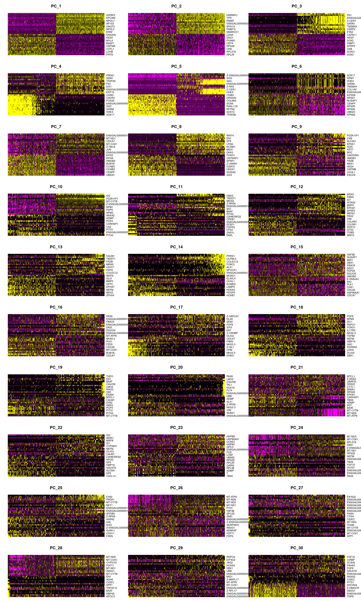
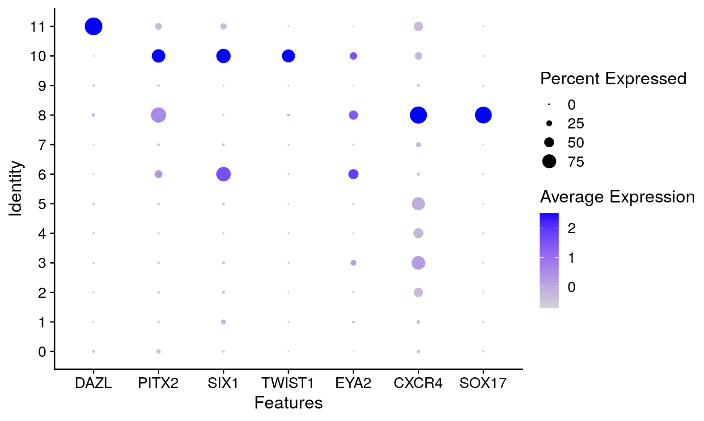
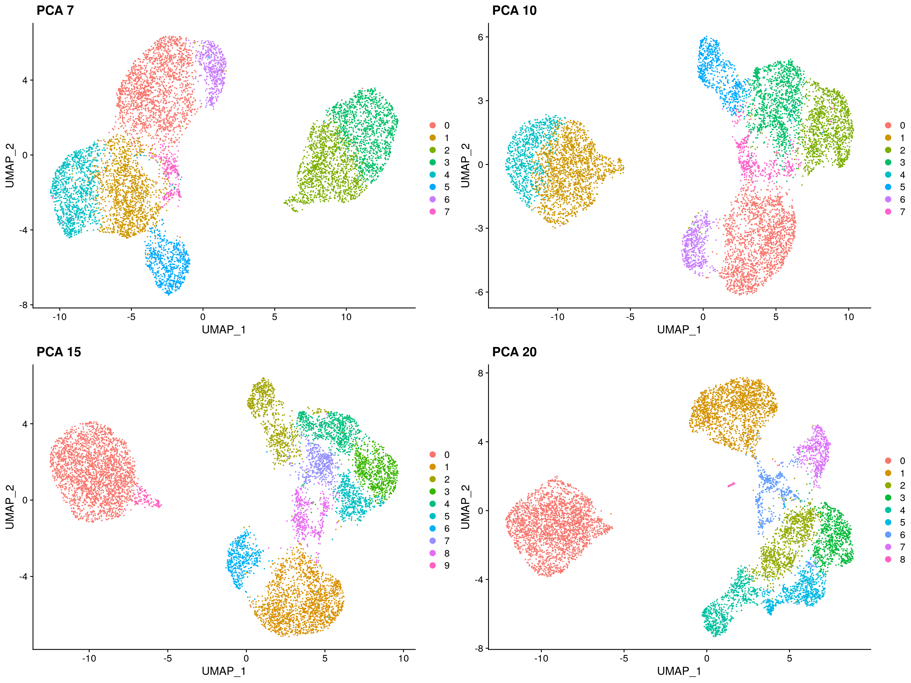

# Chick 10x Neural Development

<p align="center">


</p>

This repository provides the code to run the 10x single cell RNA-eq analysis.


- [Data availability](#data-availability)
- [Analysis pre-requisites](#analysis-pre-requisites)
- [Docker](#docker)
- [Nextflow](#nextflow)
- [Interactive downstream analysis](#interactive-downstream-analysis)
- [Downstream analysis pipeline](#downstream-analysis-pipeline)

#
## Data availability
#
This repository contains the required code to run the entire alignment and downstream analysis pipeline. For those who would like to re-run the analysis, the following files should be downloaded:

- to run the analysis including the alignment, the raw fastq sequencing files can be found [here]().
- to run the downstream analysis from the UMI counts generated from 10x Genomics Cell Ranger are embedded can be found within the repository [here]("./alignmentOut/cellrangerCounts_renamed").

#
## Analysis pre-requisites
#
The pipeline is run using Nextflow and Docker to ensure reproducibility. The repository can be called directly from GitHub, so to re-run the analysis you just need to install [Nextflow](https://www.nextflow.io/docs/latest/getstarted.html#installation) and [Docker](https://docs.docker.com/get-docker/).

If you are wanting to run the downstream analysis interactively outside of Nextflow, you still need to download Docker and you will also need to download this repository.

#
## Docker
#
Docker allows us to run our analysis through a container with all required libraries and dependencies. This ensures cross-platform reproducibility of our results.

The docker image used can be found [here](https://hub.docker.com/r/alexthiery/10x_neural_tube)

We have also included Rstudio within our docker image to allow you to run the downstream analysis interactively if you wish - for details on how to do this click [here](#interactive-downstream-analysis).

#
## Nextflow
#
You can easily re-run our entire pipeline in Nextflow using the following steps:
1) Install Nextflow and Docker
2) Download chick genome ([galgal6](http://ftp.ensembl.org/pub/release-97/fasta/gallus_gallus/dna/Gallus_gallus.GRCg6a.dna.toplevel.fa.gz))
3) Download annotation gtf ([galgal6](http://ftp.ensembl.org/pub/release-97/gtf/gallus_gallus/Gallus_gallus.GRCg6a.97.gtf.gz))
2) Download raw reads from [here]()
3) Make a sampleInfo.csv file containing the sample names and corresponding paths using this [template](sampleInfo.csv)
4) Run Nextflow using the following command

``` sh
nextflow run alexthiery/10x_neural_tube \
-profile docker \
--metadata <path to sampleInfo.csv> \
--gtf <path to gtf> \
--fa <path to genome>
```

This pipeline is configured to be ran on a cluster with 224GB memory and 32CPUs by default. The `-profile` flag can be used to set  either 'docker' or 'singularity', depending on the container application installed on your system. These settings can be adjusted  by replacing the `-profile` flag with a custom config file as below.

``` sh
nextflow run alexthiery/10x_neural_tube \
-c <path to custom.config file> \
--metadata <path to sampleInfo.csv> \
--gtf <path to gtf> \
--fa <path to genome>
```

 For a template of a custom.config file, see [crick.config](conf/crick.config). Further information on Nextflow config files can be found [here](https://www.nextflow.io/docs/latest/config.html#configuration-file).


#
## Interactive downstream analysis
#

If do not want to re-run the alignment, but would like to run the downstream analysis from the count files, you can run RStudio from within the docker container.

To do this, follow these steps:

1) clone this repository to your local computer
2) start a terminal session and download the docker image - `docker pull alexthiery/10x_neural_tube:v1.0`
3) within terminal launch a docker container interactively - `docker run --rm -e PASSWORD=test -p 8787:8787 -v <PATH_TO_LOCAL_REPOSITORY>:/home/rstudio alexthiery/10x_neural_tube:v1.0`
4) go to `localhost:8787` in the browser to open RStudio

#
## Downstream analysis pipeline
#

This analysis is ran using Seurat v3.1. For more information see https://satijalab.org/seurat/


Set environmental variables, load data and make Seurat object
In order to be able to run the script from either Rstudio, local terminal, or cluster terminal, I add a switch which looks for command line arguments. This then sets the directory paths accordingly.

``` R
#!/usr/bin/env Rscript

library('getopt')

# set arguments for Rscript
spec = matrix(c(
  'runtype', 'l', 2, "character",
  'cores'   , 'c', 2, "integer",
  'customFuncs', 'm', 2, "character",
  'networkGenes', 'd', 2, "character"
), byrow=TRUE, ncol=4)
opt = getopt(spec)

# set default location
if(length(commandArgs(trailingOnly = TRUE)) == 0){
  cat('No command line arguments provided, user defaults paths are set for running interactively in Rstudio on docker\n')
  opt$runtype = "user"
} else {
  if(is.null(opt$runtype)){
    stop("--runtype must be either 'user', 'nextflow' or 'docker'")
  }
  if(tolower(opt$runtype) != "docker" & tolower(opt$runtype) != "user" & tolower(opt$runtype) != "nextflow"){
    stop("--runtype must be either 'user', 'nextflow' or 'docker'")
  }
  if(tolower(opt$runtype) == "nextflow"){
    if(is.null(opt$customFuncs)){
      stop("--customFuncs path must be specified")
    }
    if(is.null(opt$networkGenes)){
      stop("--networkGenes path must be specified")
    }
  }
}

####################################################################
# user paths need to be defined here in order to run interactively #
####################################################################
if (opt$runtype == "user"){
  sapply(list.files('./bin/R/custom_functions/', full.names = T), source)
  
  plot.path = "./results/R_results/plots/"
  rds.path = "./results/R_results/RDS.files/"
  dir.create(plot.path, recursive = T)
  dir.create(rds.path, recursive = T)
  
  ##################################
  # set path where data is located #
  ##################################
  data_path = "./alignmentOut/cellrangerCounts_renamed"
  
  # read all files from dir
  files <- list.files(data_path, recursive = T, full.names = T)
  # remove file suffix
  file.path <- dirname(files)[!duplicated(dirname(files))]
  # make dataframe with tissue matching directory
  tissue = c("hh4", "hh6", "ss4", "ss8")
  matches <- sapply(tissue, function(x) file.path[grep(pattern = x, x = file.path)])
  sample.paths <- data.frame(tissue = names(matches), path = matches, row.names = NULL)
  
  # Read in favourite genes
  network_genes <- list.files("./bin/network_genes/", full.names = T)
  hh4_genes <- read.table(network_genes[grepl("HH4", network_genes)], stringsAsFactors = F)[,1]
  hh6_genes <- read.table(network_genes[grepl("HH6", network_genes)], stringsAsFactors = F)[,1]

} else if (opt$runtype == "nextflow"){
  cat('pipeling running through nextflow\n')
  
  sapply(list.files(opt$customFuncs, full.names = T), source)
  
  plot.path = "plots/"
  dir.create(plot.path, recursive = T)
  rds.path = "RDS.files/"
  dir.create(rds.path, recursive = T)
  
  # read all files from folder and keep only those from chr_edit
  files <- list.files("./", recursive = T, full.names = T)
  # remove file suffix
  file.path <- dirname(files)[!duplicated(dirname(files))]
  # make dataframe with tissue matching directory
  tissue = c("hh4", "hh6", "ss4", "ss8")
  matches <- sapply(tissue, function(x) file.path[grep(pattern = x, x = file.path)])
  sample.paths <- data.frame(tissue = names(matches), path = matches, row.names = NULL)
  
  # Read in favourite genes
  network_genes <- list.files(opt$networkGenes, full.names = T)
  hh4_genes <- read.table(network_genes[grepl("HH4", network_genes)], stringsAsFactors = F)[,1]
  hh6_genes <- read.table(network_genes[grepl("HH6", network_genes)], stringsAsFactors = F)[,1]

} else if (opt$runtype == "docker"){
  cat('R script running through docker\n')
  
  sapply(list.files('/home/bin/R/custom_functions/', full.names = T), source)
  
  plot.path = "/home/results/R_results/plots/"
  rds.path = "/home/results/R_results/RDS.files/"
  dir.create(plot.path, recursive = T)
  dir.create(rds.path, recursive = T)
  
  data_path = "/home/alignmentOut/cellrangerCounts_renamed"
  # read all files from dir
  files <- list.files(data_path, recursive = T, full.names = T)
  # remove file suffix
  file.path <- dirname(files)[!duplicated(dirname(files))]
  # make dataframe with tissue matching directory
  tissue = c("hh4", "hh6", "ss4", "ss8")
  matches <- sapply(tissue, function(x) file.path[grep(pattern = x, x = file.path)])
  sample.paths <- data.frame(tissue = names(matches), path = matches, row.names = NULL)
  
  # Read in favourite genes
  network_genes <- list.files("/home/bin/network_genes/", full.names = T)
  hh4_genes <- read.table(network_genes[grepl("HH4", network_genes)], stringsAsFactors = F)[,1]
  hh6_genes <- read.table(network_genes[grepl("HH6", network_genes)], stringsAsFactors = F)[,1]
}

# set number of cores to use for parallelisation
if(is.null(opt$cores)){ncores = 4}else{ncores= opt$cores}
cat(paste0("script ran with ", ncores, " cores\n"))
```

Load packages

``` R
reticulate::use_python('/usr/bin/python3.7')
library(Seurat)

library(future)
library(dplyr)
library(cowplot)
library(clustree)
library(gridExtra)
library(grid)
library(pheatmap)
library(RColorBrewer)
```

Make Seurat objects for each of the different samples.
``` R
for(i in 1:nrow(sample.paths["path"])){
  name<-paste(sample.paths[i,"tissue"])
  assign(name, CreateSeuratObject(counts= Read10X(data.dir = paste(sample.paths[i,"path"])), project = paste(sample.paths[i, "tissue"])))
}
```

The four Seurat objects are then merged, before running CreateSeuratObject again on the output in order to apply the min.cells parameter on the final merged dataset.
``` R
temp <- merge(hh4, y = c(hh6, ss4, ss8), add.cell.ids = c("hh4", "hh6", "ss4", "ss8"), project = "chick.10x")
merged.data<-CreateSeuratObject(GetAssayData(temp), min.cells = 3, project = "chick.10x.mincells3")
```

Make seurat object with ensembl names and save as separate dataframe for adding to misc slot
``` R
for(i in 1:nrow(sample.paths["path"])){
  name<-paste(sample.paths[i,"tissue"])
  assign(paste0(name, "_ensID"), CreateSeuratObject(counts= Read10X(data.dir = paste(sample.paths[i,"path"]), gene.column = 1), project = paste(sample.paths[i, "tissue"])))
}
temp <- merge(hh4_ensID, y = c(hh6_ensID, ss4_ensID, ss8_ensID), add.cell.ids = c("hh4", "hh6", "ss4", "ss8"), project = "chick.10x")
merged.data_ensID<-CreateSeuratObject(GetAssayData(temp), min.cells = 3, project = "chick.10x.mincells3")
```

Add gene IDs dataframe to merged data object
``` R
Misc(merged.data, slot = "geneIDs") <- cbind("gene_ID" = rownames(merged.data_ensID), "gene_name" =  rownames(merged.data))
```

The original Seurat objects are then removed from the global environment
``` R
rm(hh4, hh6, ss4, ss8, sample.paths, temp, hh4_ensID, hh6_ensID, ss4_ensID, ss8_ensID, merged.data_ensID)
```

Store mitochondrial percentage in object meta data
``` R
merged.data <- PercentageFeatureSet(merged.data, pattern = "^MT-", col.name = "percent.mt")
```

<br />

#### Filter data based on variable threshold

Remove data which do not pass filter threshold
``` R
merged.data <- subset(merged.data, subset = c(nFeature_RNA > 1000 & nFeature_RNA < 6000 & percent.mt < 15))
```

Log normalize data and find variable features
``` R
norm.data <- NormalizeData(merged.data, normalization.method = "LogNormalize", scale.factor = 10000)
norm.data <- FindVariableFeatures(norm.data, selection.method = "vst", nfeatures = 2000)
```

Enable parallelisation
``` R
plan("multiprocess", workers = ncores)
options(future.globals.maxSize = 2000 * 1024^2)
```

Scale data and regress out MT content
``` R
norm.data <- ScaleData(norm.data, features = rownames(norm.data), vars.to.regress = "percent.mt")
```

Save RDS after scaling as this step takes time
``` R
saveRDS(norm.data, paste0(rds.path, "norm.data.RDS"))
```

<br />

#### Perform dimensionality reduction by PCA and UMAP embedding

Read in RDS data if needed
``` R
# norm.data <- readRDS(paste0(rds.path, "norm.data.RDS"))
```

Change plot path
``` R
curr.plot.path <- paste0(plot.path, '0_filt_data/')
dir.create(curr.plot.path)
```

Run PCA analysis on the each set of data
``` R
norm.data <- RunPCA(object = norm.data, verbose = FALSE)
```

Seurat's clustering algorithm is based on principle components, so we need to ensure that only the informative PCs are kept

Plot heatmap of top variable genes across top principle components
``` R
png(paste0(curr.plot.path, "dimHM.png"), width=30, height=50, units = 'cm', res = 200)
DimHeatmap(norm.data, dims = 1:30, balanced = TRUE, cells = 500)
graphics.off()
```

Another heuristic method is ElbowPlot which ranks PCs based on the % variance explained by each PC
``` R
png(paste0(curr.plot.path, "elbowplot.png"), width=24, height=20, units = 'cm', res = 200)
print(ElbowPlot(norm.data, ndims = 40))
graphics.off()
```

Run clustering and UMAP at different PCA cutoffs - save this output to compare the optimal number of PCs to be used
``` R
png(paste0(curr.plot.path, "UMAP_PCA_comparison.png"), width=40, height=30, units = 'cm', res = 200)
PCA.level.comparison(norm.data, PCA.levels = c(7, 10, 15, 20), cluster_res = 0.5)
graphics.off()
```

|Dimensions heatmap|ElbowPlot|PCA level comparison|
| :---: | :---: | :---: |
||||

<br />

Use PCA=15 as elbow plot is relatively stable across stages
Use clustering resolution = 0.5 for filtering
``` R
norm.data <- FindNeighbors(norm.data, dims = 1:15, verbose = FALSE)
norm.data <- RunUMAP(norm.data, dims = 1:15, verbose = FALSE)
norm.data <- FindClusters(norm.data, resolution = 0.5, verbose = FALSE)
```

Plot UMAP for clusters and developmental stage
``` R
png(paste0(curr.plot.path, "UMAP.png"), width=40, height=20, units = 'cm', res = 200)
clust.stage.plot(norm.data)
graphics.off()
```

Plot QC for each cluster
``` R
png(paste0(curr.plot.path, "cluster.QC.png"), width=40, height=14, units = 'cm', res = 200)
QC.plot(norm.data)
graphics.off()
```

|UMAP|Clsuter QC|
| :---: | :---: |
||             

<br />

Find differentially expressed genes and plot heatmap of top 15 DE genes for each cluster
```{r eval = FALSE}
# Find differentially expressed genes and plot heatmap of top DE genes for each cluster
markers <- FindAllMarkers(norm.data, only.pos = T, logfc.threshold = 0.25)

# get automated cluster order based on percentage of cells in adjacent stages
cluster.order = order.cell.stage.clust(seurat_object = norm.data, col.to.sort = seurat_clusters, sort.by = orig.ident)

# Re-order genes in top15 based on desired cluster order in subsequent plot - this orders them in the heatmap in the correct order
top15 <- markers %>% group_by(cluster) %>% top_n(n = 15, wt = avg_logFC) %>% arrange(factor(cluster, levels = cluster.order))

png(paste0(curr.plot.path, 'HM.top15.DE.png'), height = 50, width = 75, units = 'cm', res = 700)
tenx.pheatmap(data = norm.data, metadata = c("seurat_clusters", "orig.ident"), custom_order_column = "seurat_clusters",
              custom_order = cluster.order, selected_genes = unique(top15$gene), gaps_col = "seurat_clusters")
graphics.off()
```

**Heatmap clearly shows clusters segregate by sex - check this and remove sex genes**


#
### Calculating sex effect and removing sex genes
#

Change plot path
``` R
curr.plot.path <- paste0(plot.path, '1_sex_filt/')
dir.create(curr.plot.path)
```

There is a strong sex effect - this plot shows DE genes between clusters 1 and 2 which are hh4 clusters. Clustering is driven by sex genes
``` R
png(paste0(curr.plot.path, 'HM.top15.DE.pre-sexfilt.png'), height = 40, width = 70, units = 'cm', res = 500)
tenx.pheatmap(data = norm.data[,rownames(norm.data@meta.data[norm.data$seurat_clusters == 1 | norm.data$seurat_clusters == 2,])],
              metadata = c("seurat_clusters", "orig.ident"), selected_genes = rownames(FindMarkers(norm.data, ident.1 = 1, ident.2 = 2)),
              hclust_rows = T, gaps_col = "seurat_clusters")
graphics.off()
```


Use W chromosome genes to K-means cluster the cells into male (zz) and female (zw)
``` R
W_genes <- as.matrix(norm.data@assays$RNA[grepl("W-", rownames(norm.data@assays$RNA)),])
k_clusters <- kmeans(t(W_genes), 2)
k_clusters <- data.frame(k_clusters$cluster)
norm.data@meta.data$k_clusters <- k_clusters[match(colnames(norm.data@assays$RNA), rownames(k_clusters)),]
```

Get rownames for kmeans clusters 1 and 2
``` R
k_clus_1 <- rownames(norm.data@meta.data[norm.data@meta.data$k_clusters == 1,])
k_clus_2 <- rownames(norm.data@meta.data[norm.data@meta.data$k_clusters == 2,])
```

K clustering identities are stochastic, so I need to identify which cluster is male and female
Sum of W genes is order of magnitude greater in cluster 2 - these are the female cells
``` R
sumclus1 <- sum(W_genes[,k_clus_1])
sumclus2 <- sum(W_genes[,k_clus_2])

if(sumclus1 < sumclus2){
  k.male <- k_clus_1
  k.female <- k_clus_2
} else {
  k.female <- k_clus_1
  k.male <- k_clus_2
}

cell.sex.ID <- list("male.cells" = k.male, "female.cells" = k.female)
saveRDS(cell.sex.ID, paste0(rds.path, "sex_kmeans.RDS"))
```

Add sex data to meta.data
``` R
norm.data@meta.data$sex <- unlist(lapply(rownames(norm.data@meta.data), function(x)
  if(x %in% k.male){"male"} else if(x %in% k.female){"female"} else{stop("cell sex is not assigned")}))
```

<br />

#### Filter W chrom genes

Following subsetting of cells and/or genes, the same pipeline as above is repeated i.e.
Find variable features -> Scale data/regress out confounding variables -> PCA -> Find neighbours -> Run UMAP -> Find Clusters -> Cluster QC -> Find top DE genes

Remove W genes
``` R
norm.data.sexscale <- norm.data[rownames(norm.data)[!grepl("W-", rownames(norm.data))],]
```

Re-run findvariablefeatures and scaling
``` R
norm.data.sexscale <- FindVariableFeatures(norm.data.sexscale, selection.method = "vst", nfeatures = 2000)

# Enable parallelisation
plan("multiprocess", workers = ncores)
options(future.globals.maxSize = 2000 * 1024^2)

norm.data.sexscale <- ScaleData(norm.data.sexscale, features = rownames(norm.data.sexscale), vars.to.regress = c("percent.mt", "sex"))
```

Save RDS
``` R
saveRDS(norm.data.sexfilt, paste0(rds.path, "norm.data.sexfilt.RDS"))
```

Read in RDS data if needed
``` R
# norm.data.sexfilt <- readRDS(paste0(rds.path, "norm.data.sexfilt.RDS"))
```

Set plot path
``` R
curr.plot.path <- paste0(plot.path, '1_sex_filt/')
```

PCA
``` R
norm.data.sexfilt <- RunPCA(object = norm.data.sexfilt, verbose = FALSE)

png(paste0(curr.plot.path, "dimHM.png"), width=30, height=50, units = 'cm', res = 200)
DimHeatmap(norm.data.sexfilt, dims = 1:30, balanced = TRUE, cells = 500)
graphics.off()

png(paste0(curr.plot.path, "elbowplot.png"), width=24, height=20, units = 'cm', res = 200)
print(ElbowPlot(norm.data.sexfilt, ndims = 40))
graphics.off()

png(paste0(curr.plot.path, "UMAP_PCA_comparison.png"), width=40, height=30, units = 'cm', res = 200)
PCA.level.comparison(norm.data.sexfilt, PCA.levels = c(7, 10, 15, 20), cluster_res = 0.5)
graphics.off()
```

|Dimensions heatmap|ElbowPlot|PCA level comparison|
| :---: | :---: | :---: |
||||

<br />

Use PCA=15 as elbow plot is relatively stable across stages
``` R
norm.data.sexscale <- FindNeighbors(norm.data.sexscale, dims = 1:15, verbose = FALSE)
norm.data.sexscale <- RunUMAP(norm.data.sexscale, dims = 1:15, verbose = FALSE)
```

Find optimal cluster resolution
``` R
png(paste0(curr.plot.path, "clustree.png"), width=70, height=35, units = 'cm', res = 200)
clust.res(seurat.obj = norm.data.sexscale, by = 0.1)
graphics.off()
```

Use clustering resolution = 0.5 to look for contamination clusters
``` R
norm.data.sexscale <- FindClusters(norm.data.sexscale, resolution = 0.5, verbose = FALSE)
```

Plot UMAP for clusters and developmental stage
``` R
png(paste0(curr.plot.path, "UMAP.png"), width=40, height=20, units = 'cm', res = 200)
clust.stage.plot(norm.data.sexscale)
graphics.off()
```

Plot QC for each cluster
``` R
png(paste0(curr.plot.path, "cluster.QC.png"), width=40, height=14, units = 'cm', res = 200)
QC.plot(norm.data.sexscale)
graphics.off()
```

|ClusTree|UMAP|Cluster QC|
| :---: | :---: | :---: |
|||             

<br />

Find differentially expressed genes and plot heatmap of top DE genes for each cluster
``` R
markers <- FindAllMarkers(norm.data.sexscale, only.pos = T, logfc.threshold = 0.25)
# get automated cluster order based on percentage of cells in adjacent stages
cluster.order = order.cell.stage.clust(seurat_object = norm.data.sexscale, col.to.sort = seurat_clusters, sort.by = orig.ident)
# Re-order genes in top15 based on desired cluster order in subsequent plot - this orders them in the heatmap in the correct order
top15 <- markers %>% group_by(cluster) %>% top_n(n = 15, wt = avg_logFC) %>% arrange(factor(cluster, levels = cluster.order))

png(paste0(curr.plot.path, 'HM.top15.DE.post-sexfilt.png'), height = 75, width = 100, units = 'cm', res = 500)
tenx.pheatmap(data = norm.data.sexscale, metadata = c("seurat_clusters", "orig.ident"), custom_order_column = "seurat_clusters",
              custom_order = cluster.order, selected_genes = unique(top15$gene), gaps_col = "seurat_clusters")
graphics.off()
```


<br />

### Identify and remove contamination

Change plot path
``` R
curr.plot.path <- paste0(plot.path, "2_cluster_filt/")
dir.create(curr.plot.path)
```

Identify mesoderm and PGCs using candidate genes
``` R
genes <- c("EYA2", "SIX1", "TWIST1", "PITX2", "SOX17", "DAZL", "DND1", "CXCR4")

ncol = 3
png(paste0(curr.plot.path, "UMAP_GOI.png"), width = ncol*10, height = 12*ceiling(length(genes)/ncol), units = "cm", res = 200)
multi.feature.plot(seurat.obj = norm.data.sexfilt, gene.list = genes, plot.clusters = T,
                   plot.stage = T, label = "", cluster.col = "RNA_snn_res.1.4", n.col = ncol)
graphics.off()
```


Dotplot for identifying PGCs, Early mesoderm and Late mesoderm
``` R
png(paste0(curr.plot.path, "dotplot.GOI.png"), width = 20, height = 12, units = "cm", res = 200)
DotPlot(norm.data.sexfilt, features = c( "SOX17", "CXCR4","EYA2", "TWIST1", "SIX1",  "PITX2", "DAZL"))
graphics.off()
```


|Feature plots|DotPlots|
| :---: | :---: |
||             

<br />

### Remove contaminating cells from clusters
Clust 8 = early mesoderm - expresses sox17, eya2, pitx2, cxcr4
Clust 10 = Late mesoderm - expresses twist1, six1, eya2
Clust 11 = PGC's - expresses dazl very highly
``` R
norm.data.contamfilt <- rownames(norm.data.sexscale@meta.data)[norm.data.sexscale@meta.data$seurat_clusters ==  8 |
                                                                norm.data.sexscale@meta.data$seurat_clusters == 10 |
                                                                norm.data.sexscale@meta.data$seurat_clusters == 11]

norm.data.contamfilt <- subset(norm.data.sexscale, cells = norm.data.contamfilt, invert = T)
```

Re-run findvariablefeatures and scaling
``` R
norm.data.contamfilt <- FindVariableFeatures(norm.data.contamfilt, selection.method = "vst", nfeatures = 2000)

# Enable parallelisation
plan("multiprocess", workers = ncores)
options(future.globals.maxSize = 2000 * 1024^2)

norm.data.contamfilt <- ScaleData(norm.data.contamfilt, features = rownames(norm.data.contamfilt), vars.to.regress = c("percent.mt", "sex"))

saveRDS(norm.data.contamfilt, paste0(rds.path, "norm.data.contamfilt.RDS"))
```
Read in RDS data if needed
``` R
# norm.data.contamfilt <- readRDS(paste0(rds.path, "norm.data.contamfilt.RDS"))
```

PCA
``` R
norm.data.contamfilt <- RunPCA(object = norm.data.contamfilt, verbose = FALSE)

png(paste0(curr.plot.path, "dimHM.png"), width=30, height=50, units = 'cm', res = 200)
DimHeatmap(norm.data.contamfilt, dims = 1:30, balanced = TRUE, cells = 500)
graphics.off()

png(paste0(curr.plot.path, "elbowplot.png"), width=24, height=20, units = 'cm', res = 200)
print(ElbowPlot(norm.data.contamfilt, ndims = 40))
graphics.off()

png(paste0(curr.plot.path, "UMAP_PCA_comparison.png"), width=40, height=30, units = 'cm', res = 200)
PCA.level.comparison(norm.data.contamfilt, PCA.levels = c(7, 10, 15, 20), cluster_res = 0.5)
graphics.off()
```

|Dimensions heatmap|ElbowPlot|PCA level comparison|
| :---: | :---: | :---: |
||||

<br />

Use PCA=15 as elbow plot is relatively stable across stages
``` R
norm.data.contamfilt <- FindNeighbors(norm.data.contamfilt, dims = 1:15, verbose = FALSE)
norm.data.contamfilt <- RunUMAP(norm.data.contamfilt, dims = 1:15, verbose = FALSE)
```

Find optimal cluster resolution
``` R
png(paste0(curr.plot.path, "clustree.png"), width=70, height=35, units = 'cm', res = 200)
clust.res(seurat.obj = norm.data.contamfilt, by = 0.2)
graphics.off()
```

Use clustering resolution = 1.4 in order to make lots of clusters and identify any remaining poor quality cells
``` R
norm.data.contamfilt <- FindClusters(norm.data.contamfilt, resolution = 1.4)
```

Plot UMAP for clusters and developmental stage
``` R
png(paste0(curr.plot.path, "UMAP.png"), width=40, height=20, units = 'cm', res = 200)
clust.stage.plot(norm.data.contamfilt)
graphics.off()
```

Plot QC for each cluster
``` R
png(paste0(curr.plot.path, "cluster.QC.png"), width=45, height=14, units = 'cm', res = 200)
QC.plot(norm.data.contamfilt)
graphics.off()
```

|ClusTree|UMAP|Cluster QC|
| :---: | :---: | :---: |
|||             

<br />

### Remove poor quality clusters

Clust 11, 14, 16, 18 = poor quality cells
``` R
norm.data.clustfilt <- rownames(norm.data.contamfilt@meta.data)[norm.data.contamfilt@meta.data$seurat_clusters ==  11 |
                                                                  norm.data.contamfilt@meta.data$seurat_clusters == 14 |
                                                                  norm.data.contamfilt@meta.data$seurat_clusters == 16 |
                                                                  norm.data.contamfilt@meta.data$seurat_clusters == 18]

norm.data.clustfilt <- subset(norm.data.contamfilt, cells = norm.data.clustfilt, invert = T)
```

Re-run findvariablefeatures and scaling
``` R
norm.data.clustfilt <- FindVariableFeatures(norm.data.clustfilt, selection.method = "vst", nfeatures = 2000)

# Enable parallelisation
plan("multiprocess", workers = ncores)
options(future.globals.maxSize = 2000 * 1024^2)

norm.data.clustfilt <- ScaleData(norm.data.clustfilt, features = rownames(norm.data.clustfilt), vars.to.regress = c("percent.mt", "sex"))

saveRDS(norm.data.clustfilt, paste0(rds.path, "norm.data.clustfilt.RDS"))
```

Read in RDS data if needed
``` R
# norm.data.clustfilt <- readRDS(paste0(rds.path, "norm.data.clustfilt.RDS"))
```

Change plot path
``` R
curr.plot.path <- paste0(plot.path, "3_cluster_filt/")
dir.create(curr.plot.path)
```

PCA
``` R
norm.data.clustfilt <- RunPCA(object = norm.data.clustfilt, verbose = FALSE)

png(paste0(curr.plot.path, "dimHM.png"), width=30, height=50, units = 'cm', res = 200)
DimHeatmap(norm.data.clustfilt, dims = 1:30, balanced = TRUE, cells = 500)
graphics.off()

png(paste0(curr.plot.path, "elbowplot.png"), width=24, height=20, units = 'cm', res = 200)
print(ElbowPlot(norm.data.clustfilt, ndims = 40))
graphics.off()

png(paste0(curr.plot.path, "UMAP_PCA_comparison.png"), width=40, height=30, units = 'cm', res = 200)
PCA.level.comparison(norm.data.clustfilt, PCA.levels = c(7, 10, 15, 20), cluster_res = 0.5)
graphics.off()
```

|Dimensions heatmap|ElbowPlot|PCA level comparison|
| :---: | :---: | :---: |
||||

<br />

Use PCA=15 as elbow plot is relatively stable across stages
``` R
norm.data.clustfilt <- FindNeighbors(norm.data.clustfilt, dims = 1:15, verbose = FALSE)
norm.data.clustfilt <- RunUMAP(norm.data.clustfilt, dims = 1:15, verbose = FALSE)
```

Find optimal cluster resolution
``` R
png(paste0(curr.plot.path, "clustree.png"), width=70, height=35, units = 'cm', res = 200)
clust.res(seurat.obj = norm.data.clustfilt, by = 0.2)
graphics.off()
```

Use clustering resolution = 0.8
``` R
norm.data.clustfilt <- FindClusters(norm.data.clustfilt, resolution = 0.8)
```

Plot UMAP for clusters and developmental stage
``` R
png(paste0(curr.plot.path, "UMAP.png"), width=40, height=20, units = 'cm', res = 200)
clust.stage.plot(norm.data.clustfilt)
graphics.off()
```

Plot QC for each cluster
``` R
png(paste0(curr.plot.path, "cluster.QC.png"), width=45, height=14, units = 'cm', res = 200)
QC.plot(norm.data.contamfilt)
graphics.off()
```

|ClusTree|UMAP|Cluster QC|
| :---: | :---: | :---: |
|||             

<br />

### Check for cell cycle effect

Set plot path
``` R
curr.plot.path <- paste0(plot.path, "4_cell_cycle/")
dir.create(curr.plot.path)
```

Calculate cell cycle for each cell
``` R
s.genes <- cc.genes$s.genes
g2m.genes <- cc.genes$g2m.genes
pre.cell.cycle.dat <- CellCycleScoring(norm.data.clustfilt, s.features = s.genes, g2m.features = g2m.genes, set.ident = TRUE)
```

``` R
Re-run findvariablefeatures and scaling
norm.data.clustfilt.cc <- FindVariableFeatures(pre.cell.cycle.dat, selection.method = "vst", nfeatures = 2000)

# Enable parallelisation
plan("multiprocess", workers = ncores)
options(future.globals.maxSize = 2000 * 1024^2)

norm.data.clustfilt.cc <- ScaleData(norm.data.clustfilt.cc, features = rownames(norm.data.clustfilt.cc), vars.to.regress = c("percent.mt", "sex", "S.Score", "G2M.Score"))

saveRDS(norm.data.clustfilt.cc, paste0(rds.path, "norm.data.clustfilt.cc.RDS"))
```

Read in RDS data if needed
``` R
# norm.data.clustfilt.cc <- readRDS(paste0(rds.path, "norm.data.clustfilt.cc.RDS"))
```

PCA
``` R
norm.data.clustfilt.cc <- RunPCA(object = norm.data.clustfilt.cc, verbose = FALSE)

png(paste0(curr.plot.path, "dimHM.png"), width=30, height=50, units = 'cm', res = 200)
DimHeatmap(norm.data.clustfilt.cc, dims = 1:30, balanced = TRUE, cells = 500)
graphics.off()

png(paste0(curr.plot.path, "elbowplot.png"), width=24, height=20, units = 'cm', res = 200)
print(ElbowPlot(norm.data.clustfilt.cc, ndims = 40))
graphics.off()

png(paste0(curr.plot.path, "UMAP_PCA_comparison.png"), width=40, height=30, units = 'cm', res = 200)
PCA.level.comparison(norm.data.clustfilt.cc, PCA.levels = c(7, 10, 15, 20), cluster_res = 0.5)
graphics.off()
```

|Dimensions heatmap|ElbowPlot|PCA level comparison|
| :---: | :---: | :---: |
||||

<br />

Use PCA=15 as elbow plot is relatively stable across stages
``` R
norm.data.clustfilt.cc <- FindNeighbors(norm.data.clustfilt.cc, dims = 1:15, verbose = FALSE)
norm.data.clustfilt.cc <- RunUMAP(norm.data.clustfilt.cc, dims = 1:15, verbose = FALSE)
```

``` R
Find optimal cluster resolution
png(paste0(curr.plot.path, "clustree.png"), width=70, height=35, units = 'cm', res = 200)
clust.res(seurat.obj = norm.data.clustfilt.cc, by = 0.2)
graphics.off()
```

Use clustering resolution = 1.2
``` R
norm.data.clustfilt.cc <- FindClusters(norm.data.clustfilt.cc, resolution = 1.2)
```

UMAP of cell cycle before and after regressing out
``` R
png(paste0(curr.plot.path, "cell.cycle.png"), width=40, height=20, units = 'cm', res = 200)
pre.plot <- DimPlot(pre.cell.cycle.dat, group.by = "Phase", reduction = "umap")
post.plot <- DimPlot(norm.data.clustfilt.cc, group.by = "Phase", reduction = "umap")
print(gridExtra::grid.arrange(pre.plot, post.plot, ncol = 2))
graphics.off()
```

Plot UMAP for clusters and developmental stage
``` R
png(paste0(curr.plot.path, "UMAP.png"), width=40, height=20, units = 'cm', res = 200)
clust.stage.plot(norm.data.clustfilt.cc)
graphics.off()
```

Plot QC for each cluster
``` R
png(paste0(curr.plot.path, "cluster.QC.png"), width=40, height=14, units = 'cm', res = 200)
QC.plot(norm.data.clustfilt.cc)
graphics.off()
```

|ClusTree|UMAP|Cluster QC|
| :---: | :---: | :---: |
|||             

<br />

Find differentially expressed genes and plot heatmap of top DE genes for each cluster
``` R
markers <- FindAllMarkers(norm.data.clustfilt.cc, only.pos = T, logfc.threshold = 0.25)
# get automated cluster order based on percentage of cells in adjacent stages
cluster.order = order.cell.stage.clust(seurat_object = norm.data.clustfilt.cc, col.to.sort = seurat_clusters, sort.by = orig.ident)
# Re-order genes in top15 based on desired cluster order in subsequent plot - this orders them in the heatmap in the correct order
top15 <- markers %>% group_by(cluster) %>% top_n(n = 15, wt = avg_logFC) %>% arrange(factor(cluster, levels = cluster.order))

png(paste0(curr.plot.path, 'HM.top15.DE.png'), height = 75, width = 100, units = 'cm', res = 500)
tenx.pheatmap(data = norm.data.clustfilt.cc, metadata = c("seurat_clusters", "orig.ident"), custom_order_column = "seurat_clusters",
              custom_order = cluster.order, selected_genes = unique(top15$gene), gaps_col = "seurat_clusters")
graphics.off()
```


<br />


### Cell type identification

Set plot path
``` R
curr.plot.path <- paste0(plot.path, "5_stage_split/")
dir.create(curr.plot.path)
```

Split dataset into different stages
``` R
seurat_stage <- lapply(c('hh4', 'hh6', 'ss4', 'ss8'),
                       function(x) subset(norm.data.clustfilt.cc, cells = rownames(norm.data.clustfilt.cc@meta.data)[norm.data.clustfilt.cc$orig.ident == x]))
names(seurat_stage) = c('hh4', 'hh6', 'ss4', 'ss8')
```

Re-run findvariablefeatures and scaling
``` R
seurat_stage <- lapply(seurat_stage, function(x) FindVariableFeatures(x, selection.method = "vst", nfeatures = 2000))

# Enable parallelisation
plan("multiprocess", workers = ncores)
options(future.globals.maxSize = 2000 * 1024^2)

seurat_stage <- lapply(seurat_stage, function(x) ScaleData(x, features = rownames(norm.data.clustfilt.cc),
                                                           vars.to.regress = c("percent.mt", "sex", "S.Score", "G2M.Score")))

saveRDS(seurat_stage, paste0(rds.path, "seurat_stage.RDS"))
```

Read in RDS data if needed
``` R
# seurat_stage <- readRDS(paste0(rds.path, "seurat_stage.RDS"))
```

PCA
``` R
seurat_stage <- lapply(seurat_stage, function(x) RunPCA(object = x, verbose = FALSE))

for(stage in names(seurat_stage)){
  png(paste0(curr.plot.path, "dimHM.",stage,".png"), width=30, height=50, units = 'cm', res = 200)
  DimHeatmap(seurat_stage[[stage]], dims = 1:30, balanced = TRUE, cells = 500)
  graphics.off()
  
  png(paste0(curr.plot.path, "elbowplot.", stage, ".png"), width=24, height=20, units = 'cm', res = 200)
  print(ElbowPlot(seurat_stage[[stage]], ndims = 40))
  graphics.off()
  
  png(paste0(curr.plot.path, "UMAP_PCA_comparison.", stage, ".png"), width=40, height=30, units = 'cm', res = 200)
  PCA.level.comparison(seurat_stage[[stage]], PCA.levels = c(7, 10, 15, 20), cluster_res = 0.5)
  graphics.off()
}
```

<h1 style="font-size:150%;"; align="center">
 <b>HH4<br>
</h1>
 
|Dimensions heatmap|ElbowPlot|PCA level comparison|
| :---: | :---: | :---: |
||||

<br />

<h1 style="font-size:150%;"; align="center">
 <b>HH6<br>
</h1>
 
|Dimensions heatmap|ElbowPlot|PCA level comparison|
| :---: | :---: | :---: |
||||
 
<br />

 <h1 style="font-size:150%;"; align="center">
 <b>4ss<br>
</h1>
 
|Dimensions heatmap|ElbowPlot|PCA level comparison|
| :---: | :---: | :---: |
||||
 
<br />

 <h1 style="font-size:150%;"; align="center">
 <b>8ss<br>
</h1>
 
|Dimensions heatmap|ElbowPlot|PCA level comparison|
| :---: | :---: | :---: |
||||

<br />

Use PCA=15 as elbow plot is relatively stable across stages
``` R
seurat_stage <- lapply(seurat_stage, function(x) FindNeighbors(x, dims = 1:15, verbose = FALSE))
seurat_stage <- lapply(seurat_stage, function(x) RunUMAP(x, dims = 1:15, verbose = FALSE))
```

Find optimal cluster resolution
``` R
for(stage in names(seurat_stage)){
  png(paste0(curr.plot.path, "clustree.", stage, ".png"), width=70, height=35, units = 'cm', res = 200)
  clust.res(seurat.obj = seurat_stage[[stage]], by = 0.1)
  graphics.off()
}
```

Cluster each stage
``` R
res = c("hh4" = 0.5, "hh6" = 0.5, "ss4" = 0.5, "ss8" = 0.5)
seurat_stage <- lapply(names(res), function(x) FindClusters(seurat_stage[[x]], resolution = res[names(res) %in% x]))
names(seurat_stage) = names(res)
```

Plot UMAP for clusters and developmental stage
``` R
for(stage in names(seurat_stage)){
  png(paste0(curr.plot.path, "UMAP.", stage, ".png"), width=20, height=10, units = 'cm', res = 200)
  clust.stage.plot(seurat_stage[[stage]])
  graphics.off()
}
```

<h1 style="font-size:150%;"; align="center">
 <b>HH4<br>
</h1>
 
|ClusTree|UMAP|
| :---: | :---: |
|||  

<br />

<h1 style="font-size:150%;"; align="center">
 <b>HH6<br>
</h1>
 
|ClusTree|UMAP|
| :---: | :---: |
|||  
 
<br />

 <h1 style="font-size:150%;"; align="center">
 <b>4ss<br>
</h1>
 
|ClusTree|UMAP|
| :---: | :---: |
|||  

<br />

 <h1 style="font-size:150%;"; align="center">
 <b>8ss<br>
</h1>
 
|ClusTree|UMAP|
| :---: | :---: |
|||  

<br />

Find differentially expressed genes and plot heatmap of top DE genes for each cluster at each stage
lower FC threshold as some clusters have no DE genes
``` R
markers <- lapply(seurat_stage, function(x) FindAllMarkers(x, only.pos = T, logfc.threshold = 0.1))
top15 <- lapply(markers, function(x) x %>% group_by(cluster) %>% top_n(n = 15, wt = avg_logFC))

for(stage in names(seurat_stage)){
  png(paste0(curr.plot.path, "HM.top15.DE.", stage, ".png"), height = 75, width = 100, units = 'cm', res = 500)
  tenx.pheatmap(data = seurat_stage[[stage]], metadata = c("seurat_clusters", "orig.ident"), custom_order_column = "seurat_clusters",
                selected_genes = unique(top15[[stage]]$gene), gaps_col = "seurat_clusters")
  graphics.off()
}
```

<h1 style="font-size:150%;"; align="center">
 <b>HH4<br>
</h1>
 
 

<br />

<h1 style="font-size:150%;"; align="center">
 <b>HH6<br>
</h1>
 
 
 
<br />

 <h1 style="font-size:150%;"; align="center">
 <b>4ss<br>
</h1>
 


<br />

 <h1 style="font-size:150%;"; align="center">
 <b>8ss<br>
</h1>
 
 

<br />

Plot features listed below at each stage
``` R
GOI = list("hh4" = c("VGLL1", "EPAS1", "GRHL3", "MSX1", "DLX5", "GATA2",
                     "AATF", "MAFA", "ING5", "SETD2", "LIN28B", "YEATS4",
                     "EOMES", "ADMP"),
           "hh6" = c("DLX5", "SIX1", "GATA2", "MSX1", "BMP4", "GBX2", "SIX3", "SOX2", "SOX21"),
           "ss4" = c("SIX1", "EYA2", "CSRNP1", "PAX7", "WNT4", "SIX3", "OLIG2", "SOX2", "SOX21"),
           "ss8" = c("SIX1", "EYA2", "SOX10", "TFAP2A", "GBX2", "SIX3", "OLIG2", "SOX2", "SOX21"))

for(stage in names(GOI)){
  ncol = 3
  png(paste0(curr.plot.path, "UMAP_GOI.", stage, ".png"), width = ncol*10, height = 10*ceiling((length(unlist(GOI[names(GOI) %in% stage]))+1)/ncol), units = "cm", res = 200)
  print(multi.feature.plot(seurat_stage[[stage]], stage.name = stage, n.col = ncol, label = "", gene.list = unlist(GOI[names(GOI) %in% stage])))
  graphics.off()
}
```

|HH4|HH6|4ss|8ss|
| :---: | :---: | :---: | :---: |
|||||

Change order or clusters for plotting dotplots
``` R
levels = list("hh4" = c(3,0,1,2), "hh6" = c(1,3,4,2,0), "ss4" = c(2,3,1,0), "ss8" = c(3,2,5,0,7,1,6,4))
for(stage in names(levels)){
  seurat_stage[[stage]]$seurat_clusters <- factor(seurat_stage[[stage]]$seurat_clusters, levels = unlist(levels[names(levels) %in% stage]))
}
```

Plot dotplot to identify clusters
``` R
for(stage in names(GOI)){
  png(paste0(curr.plot.path, "dotplot.", stage, ".png"), width = 30, height = 12, units = "cm", res = 200)
  print(DotPlot(seurat_stage[[stage]], group.by = "seurat_clusters", features = unlist(GOI[names(GOI) %in% stage])) +
          theme(axis.text.x = element_text(angle = 90, hjust = 1, vjust = 0.5)))
  graphics.off()
}
```

Change target gene names if they are from Z and W chromosomes
``` R
hh4_genes <- unlist(lapply(hh4_genes, function(g) ifelse(paste0("Z-", g) %in% rownames(norm.data), paste0("Z-", g), ifelse(paste0("W-", g) %in% rownames(norm.data), paste0("W-", g), g))))
hh6_genes <- unlist(lapply(hh6_genes, function(g) ifelse(paste0("Z-", g) %in% rownames(norm.data), paste0("Z-", g), ifelse(paste0("W-", g) %in% rownames(norm.data), paste0("W-", g), g))))
```

Plot genes from hh4 gene list at each stage
``` R
lapply(names(seurat_stage), function(x) umap.gene.list(seurat_stage[[x]], hh4_genes, paste0(curr.plot.path, "hh4_genes_UMAPs/", x, "/")))
```

Plot genes from hh6 gene list at each stage
``` R
lapply(names(seurat_stage), function(x) umap.gene.list(seurat_stage[[x]], hh6_genes, paste0(curr.plot.path, "hh6_genes_UMAPs/", x, "/")))
```

Save stage data after clustering
``` R
saveRDS(seurat_stage, paste0(rds.path, 'seurat_stage_out.RDS'))
```

Read in RDS data if needed
``` R
# seurat_stage <- readRDS(paste0(rds.path, "seurat_stage_out.RDS"))
```

Make list of clusters to subset
``` R
clust.sub = list("hh4" = c(0,1,2), "hh6" = c(0,2,4), "ss4" = c(0,1), "ss8" = c(0,1,4,6,7))
```

<br />

### Subset neural cells from clear seurat data (norm.data.clustfilt.cc)

Set plot path
``` R
curr.plot.path <- paste0(plot.path, "6_neural_subset/")
dir.create(curr.plot.path)
```

Get cell IDs from each stage based on clusters to subset
``` R
cell.sub = unlist(lapply(names(clust.sub), function(x){
  rownames(seurat_stage[[x]]@meta.data)[seurat_stage[[x]]$seurat_clusters %in% unlist(clust.sub[names(clust.sub) %in% x])]
}))
```

Subset neural cells
``` R
neural.seurat <- subset(norm.data.clustfilt.cc, cells = cell.sub)
```

Re-run findvariablefeatures and scaling
``` R
neural.seurat <- FindVariableFeatures(neural.seurat, selection.method = "vst", nfeatures = 2000)

# Enable parallelisation
plan("multiprocess", workers = ncores)
options(future.globals.maxSize = 2000 * 1024^2)

neural.seurat <- ScaleData(neural.seurat, features = rownames(neural.seurat), vars.to.regress = c("percent.mt", "sex", "S.Score", "G2M.Score"))

saveRDS(neural.seurat, paste0(rds.path, "neural.seurat.RDS"))
```

Read in RDS data if needed
``` R
# neural.seurat <- readRDS(paste0(rds.path, "neural.seurat.RDS"))
```

PCA
``` R
neural.seurat <- RunPCA(object = neural.seurat, verbose = FALSE)

png(paste0(curr.plot.path, "dimHM.png"), width=30, height=50, units = 'cm', res = 200)
DimHeatmap(neural.seurat, dims = 1:30, balanced = TRUE, cells = 500)
graphics.off()

png(paste0(curr.plot.path, "elbowplot.png"), width=24, height=20, units = 'cm', res = 200)
print(ElbowPlot(neural.seurat, ndims = 40))
graphics.off()

png(paste0(curr.plot.path, "UMAP_PCA_comparison.png"), width=40, height=30, units = 'cm', res = 200)
PCA.level.comparison(neural.seurat, PCA.levels = c(7, 10, 15, 20), cluster_res = 0.5)
graphics.off()
```

Use PCA=15 as elbow plot is relatively stable across stages
``` R
neural.seurat <- FindNeighbors(neural.seurat, dims = 1:15, verbose = FALSE)
neural.seurat <- RunUMAP(neural.seurat, dims = 1:15, verbose = FALSE)
```

Find optimal cluster resolution
``` R
png(paste0(curr.plot.path, "clustree.png"), width=70, height=35, units = 'cm', res = 200)
clust.res(seurat.obj = neural.seurat, by = 0.2)
graphics.off()
```

Use clustering resolution = 1.2
``` R
neural.seurat <- FindClusters(neural.seurat, resolution = 1.2)
```

Plot UMAP for clusters and developmental stage
``` R
png(paste0(curr.plot.path, "UMAP.png"), width=40, height=20, units = 'cm', res = 200)
clust.stage.plot(neural.seurat)
graphics.off()
```

Plot QC for each cluster
``` R
png(paste0(curr.plot.path, "cluster.QC.png"), width=40, height=14, units = 'cm', res = 200)
QC.plot(neural.seurat)
graphics.off()
```

Find differentially expressed genes and plot heatmap of top DE genes for each cluster
``` R
markers <- FindAllMarkers(neural.seurat, only.pos = T, logfc.threshold = 0.25)
# get automated cluster order based on percentage of cells in adjacent stages
cluster.order = order.cell.stage.clust(seurat_object = neural.seurat, col.to.sort = seurat_clusters, sort.by = orig.ident)
# Re-order genes in top15 based on desired cluster order in subsequent plot - this orders them in the heatmap in the correct order
top15 <- markers %>% group_by(cluster) %>% top_n(n = 15, wt = avg_logFC) %>% arrange(factor(cluster, levels = cluster.order))

png(paste0(curr.plot.path, 'HM.top15.DE.png'), height = 75, width = 100, units = 'cm', res = 500)
tenx.pheatmap(data = neural.seurat, metadata = c("seurat_clusters", "orig.ident"), custom_order_column = "seurat_clusters",
              custom_order = cluster.order, selected_genes = unique(top15$gene), gaps_col = "seurat_clusters")
graphics.off()

saveRDS(neural.seurat, paste0(rds.path, "neural.seurat.out.RDS"))
```

Plot genes from hh4 gene list in neural subset
``` R
umap.gene.list(neural.seurat, hh4_genes, paste0(curr.plot.path, "hh4_genes_UMAPs/"))
# plot genes from hh6 gene list in neural subset
umap.gene.list(neural.seurat, hh4_genes, paste0(curr.plot.path, "hh6_genes_UMAPs/"))
```

Plot heatmap for hh4 genes in neural subset
``` R
png(paste0(curr.plot.path, "neural.seurat_hh4genes.HM.png"), width=75, height=100, units = "cm", res = 500)
tenx.pheatmap(data = neural.seurat, metadata = c("orig.ident", "seurat_clusters"), selected_genes = hh4_genes[hh4_genes %in% rownames(neural.seurat)],
              hclust_rows = T, gaps_col = "orig.ident", col_ann_order = c("orig.ident", "seurat_clusters"))
graphics.off()
```

Plot heatmap for hh6 genes in neural subset
``` R
png(paste0(curr.plot.path, "neural.seurat_hh6genes.HM.png"), width=75, height=100, units = "cm", res = 500)
tenx.pheatmap(data = neural.seurat, metadata = c("orig.ident", "seurat_clusters"), selected_genes = hh6_genes[hh6_genes %in% rownames(neural.seurat)],
              hclust_rows = T, gaps_col = "orig.ident", col_ann_order = c("orig.ident", "seurat_clusters"))
graphics.off()
```
