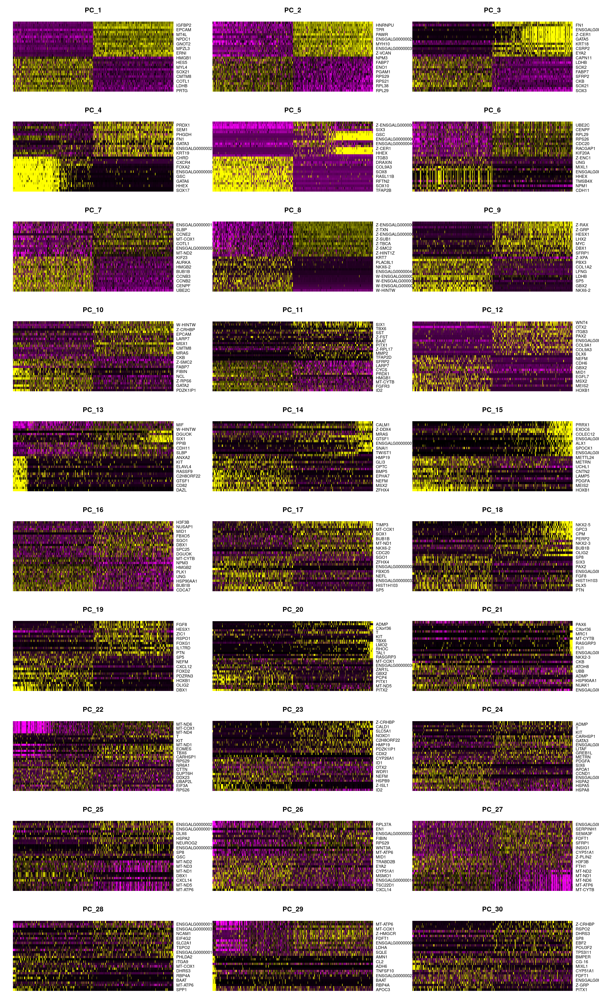
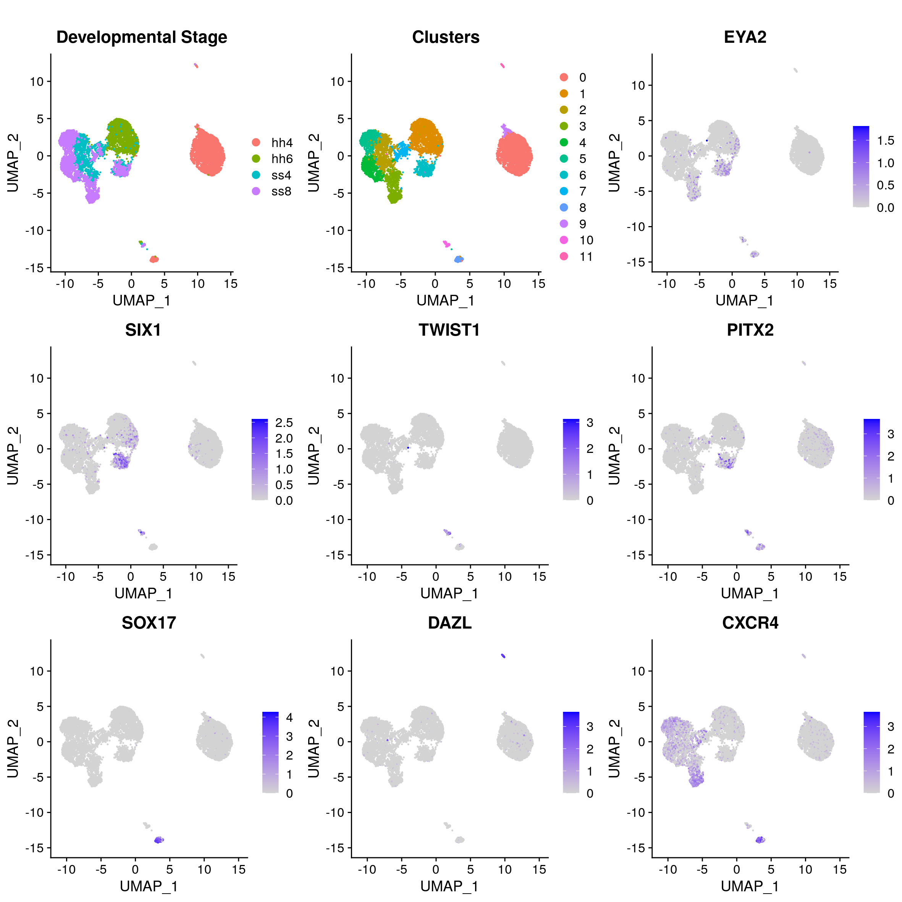
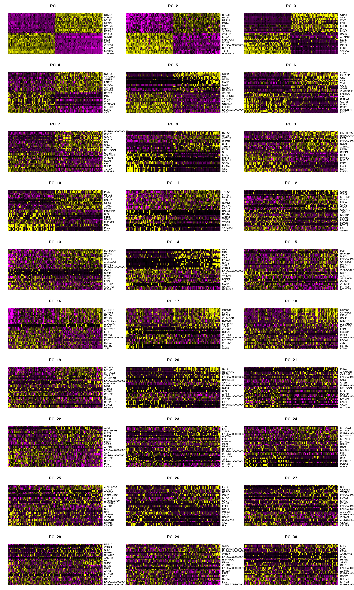
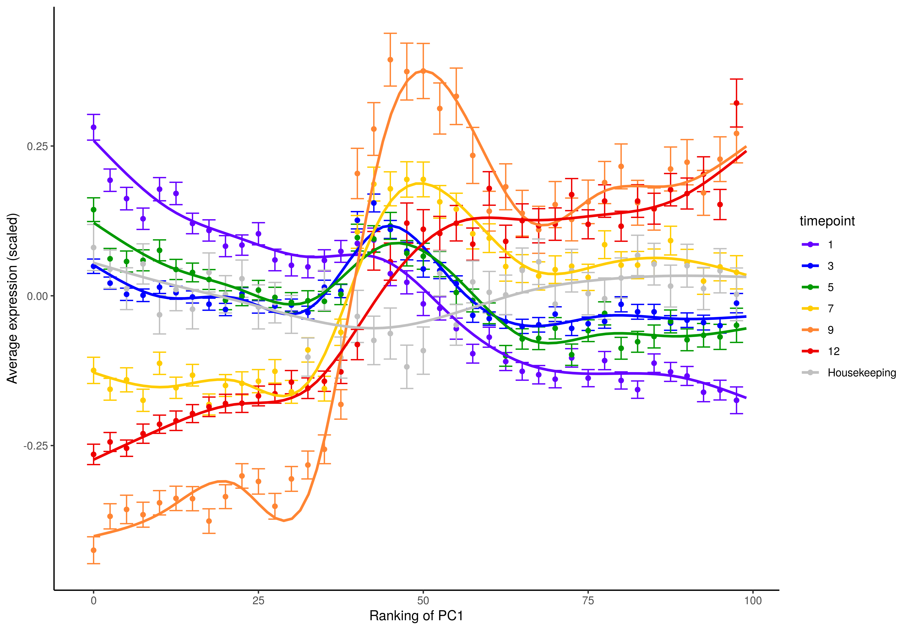

# Chick 10x Neural Development

<p align="center">


</p>

This repository provides the code to run the 10x single cell RNA-eq analysis.


- [Data availability](#data-availability)
- [Reproducing our analyses](#reproducibility)
- [Interactive downstream analysis](#interactive-downstream-analysis)
- [Downstream analysis pipeline](#downstream-analysis-pipeline)

</br>

#
## Data availability<a name="data-availability"></a>

This repository contains the required code to run the entire alignment and downstream analysis pipeline. For those who would like to re-run the analysis, the following files should be downloaded:

- to run the analysis including the alignment, the raw fastq sequencing files can be found [here]().
- to run the downstream analysis from the UMI counts generated from 10x Genomics Cell Ranger are embedded can be found within the repository [here](https://github.com/alexthiery/10x_neural_tube/tree/master/output/NF-10x_alignment/cellrangerCounts).

</br>

#
## Reproducing our analyses<a name="reproducibility"></a>


Reproducing our analysis is computationally intensive, therefore we recommend to run the pipeline on a HPC.

In order to make our analysis fully reproducible, we have developed a Nextflow pipeline which executes the analysis within our custom Docker container.

To re-run our analysis you will need to:
- [download the GitHub project repository](#download_repo)
- [install Nextflow](https://www.nextflow.io/docs/latest/getstarted.html)
- [install Docker Desktop](https://www.docker.com/get-started) (if running on local PC)
- [download GalGal5 and sequencing data](#download_data)
- [set Nextflow configuration file](#config)
- [align sequencing data](#alignment)
- [run downstream analysis](#downstream)

**Important!** All shell scripts are to be executed from the base directory of the project!

<br/>

### Download GitHub repository<a name="download_repo"></a>
#

In order to reproduce our analysis, you will first need to download our otic-repregramming GitHub repository. To do this run:

```shell
git clone https://github.com/alexthiery/10x_neural_tube
```

<br/>

### Download data<a name="download_data"></a>
#

To download the GalGal5 genome from Ensembl, run:

```shell
rsync -av rsync://ftp.ensembl.org/ensembl/pub/release-94/fasta/gallus_gallus/dna/Gallus_gallus.Gallus_gallus-5.0.dna.toplevel.fa.gz <LOCAL_PATH>
```

To download the Galgal5 gtf from Ensembl, run:


```shell
rsync -av rsync://ftp.ensembl.org/ensembl/pub/release-94/gtf/gallus_gallus/Gallus_gallus.Gallus_gallus-5.0.94.gtf.gz <LOCAL_PATH>
```

Once the genome files have been downloaded, they need to be unzipped before running the alignment.

**ADD SEQUENCING DATA DOWNLOAD PATHS**

<br/>

### Nextflow configuration file<a name="config"></a>
#

Configuration properties and file paths are passed to Nextflow via configuration files.

In order to re-run the alignments and downstream analysis for this project, you will need to create a custom configuration file which contains:

- max system resource allocation
- Docker/Singularity activation

<br/>

Below is a copy of the config file used to run the pipeline at The Francis Crick Institute HPC. Given that this alignment was run on a HPC, we configure Nextflow to run with Singularity instead of Docker.

```bash
#!/usr/bin/env nextflow

singularity {
  enabled = true
  autoMounts = true
  docker.enabled = false
}

process {
  executor = 'slurm'
}

params {
  max_memory = 224.GB
  max_cpus = 32
  max_time = 72.h
}
```

Further information on Nextflow configuration can be found [here](https://www.nextflow.io/docs/latest/config.html).

After you have saved your custom configuration file, you are ready to align the data!

<br/>

### Sequence alignment<a name="alignment"></a>
#

Our 10x data is aligned using a custom Nextflow pipeline.

Sample FASTQ paths are provided via a samplesheet csv. The template csv used to run this analysis can be found [template](NF-10x_alignment/crick_samplesheet.csv).

Once you have changed the sample paths in the samplesheet csv, execute the following commans to align the 10x data.

``` sh
export NXF_VER=20.07.1

nextflow run NF-10x_alignment/main.nf \
-c <PATH_TO_CONFIG> \
--samplesheet <PATH_TO_SAMPLESHEET> \
--output output/NF-10x_alignment \
--gtf <PATH_TO_GTF> \
--fasta <PATH_TO_GENOME> \
-resume
```

</br>

#
## Interactive downstream analysis

If do not want to re-run the alignment, but would like to run the downstream analysis from the count files, you can run RStudio from within our Docker container. This will ensure that you have all of the same packages and dependencies required to carry out the analysis.

To interactively explore the data, follow these steps:

1. clone our GitHub repository to your local computer - `git clone https://github.com/alexthiery/10x_neural_tube`
2. start a terminal session and pull the Docker image from Dockerhub - `docker pull alexthiery/10x_neural_tube:v1.1`
3. within terminal launch a Docker container interactively - `docker run --rm -e PASSWORD=password -p 8787:8787 -v <PATH_TO_LOCAL_REPOSITORY>:/home/rstudio alexthiery/10x_neural_tube:v1.1`
4. go to `localhost:8787` in the browser to open RStudio
5. enter the username `rstudio` and the password `password`
6. access the downstream analysis R script in the `Files` tab in R studio by following the path `./bin/R/seurat_full.R`

</br>

#
## Downstream analysis pipeline

This analysis is ran using Seurat v3.1.5 For more information see https://satijalab.org/seurat/. To navigate between different sections of our analysis click here:

1) [Calculating sex effect and removing sex genes](#sex_effect)
2) [Identify and remove contamination](#remove_contam)
3) [Remove poor quality clusters](#remove_poor_qual)
4) [Check for cell cycle effect](#cell_cycle)
5) [Cell state classification](#cell_state)
6) [Gene modules](#gm)
7) [Subset neural clusters](#subset_nt)
8) [Pseudotime](#pseudotime)

<br/>

Load packages

``` R
#!/usr/bin/env Rscript

reticulate::use_python('/usr/bin/python3.7')
library(Seurat)

library(getopt)
library(future)
library(cowplot)
library(clustree)
library(gridExtra)
library(grid)
library(pheatmap)
library(RColorBrewer)
library(Antler)
library(ggbeeswarm)
library(tidyverse)
```

</br>

Set environmental variables, load data and make Seurat object
In order to be able to run the script from either Rstudio, local terminal, or cluster terminal, I add a switch which looks for command line arguments. This then sets the directory paths accordingly.

``` R
# set arguments for Rscript
spec = matrix(c(
  'runtype', 'l', 2, "character",
  'cores'   , 'c', 2, "integer",
  'customFuncs', 'm', 2, "character",
  'networkGenes', 'd', 2, "character"
), byrow=TRUE, ncol=4)
opt = getopt(spec)

# set default location
if(length(commandArgs(trailingOnly = TRUE)) == 0){
  cat('No command line arguments provided, user defaults paths are set for running interactively in Rstudio on docker\n')
  opt$runtype = "user"
} else {
  if(is.null(opt$runtype)){
    stop("--runtype must be either 'user', 'nextflow' or 'docker'")
  }
  if(tolower(opt$runtype) != "docker" & tolower(opt$runtype) != "user" & tolower(opt$runtype) != "nextflow"){
    stop("--runtype must be either 'user', 'nextflow' or 'docker'")
  }
  if(tolower(opt$runtype) == "nextflow"){
    if(is.null(opt$customFuncs)){
      stop("--customFuncs path must be specified")
    }
    if(is.null(opt$networkGenes)){
      stop("--networkGenes path must be specified")
    }
  }
}

####################################################################
# user paths need to be defined here in order to run interactively #
####################################################################
if (opt$runtype == "user"){
  
  # Input data paths
  data_path = "./output/NF-10x_alignment/cellrangerCounts"
  custom_func_path = './bin/R/custom_functions/'
  network_genes_path = './input_files/network_expression.csv'

  # Output data paths  
  plot_path = "./output/NF-downstream_analysis/plots/"
  rds_path = "./output/NF-downstream_analysis/rds_files/"
  antler_dir = "./output/NF-downstream_analysis/antler_input/"

} else if (opt$runtype == "nextflow"){
  cat('pipeling running through nextflow\n')

  # Input data paths
  data_path = "./input/cellrangerCounts"
  custom_func_path = opt$customFuncs
  network_genes_path = opt$networkGenes
  
  # Output data paths
  plot_path = "./plots/"
  rds_path = "./rds_files/"
  antler_dir = "./antler_input/"

}

# Load custom functions
sapply(list.files(custom_func_path, full.names = T), source)

# Create output directories
dir.create(plot_path, recursive = T)
dir.create(rds_path, recursive = T)
dir.create(antler_dir, recursive = T)
  
# Read input files
files <- list.files(data_path, recursive = T, full.names = T)
# Remove file suffix
file.path <- dirname(files)[!duplicated(dirname(files))]
# Make dataframe with tissue matching directory
tissue = c("hh4", "hh6", "ss4", "ss8")
matches <- sapply(tissue, function(x) file.path[grep(pattern = x, x = file.path)])
sample.paths <- data.frame(tissue = names(matches), path = matches, row.names = NULL)

# Read in network genes and remove 0 timepoint
network_genes <- read.csv(network_genes_path) %>% filter(!timepoint == 0)
```

</br>

Set number of cores to use for parallelisation
```R
if(is.null(opt$cores)){ncores = 4}else{ncores= opt$cores}
cat(paste0("script ran with ", ncores, " cores\n"))
```

</br>

Make Seurat objects for each of the different samples.
``` R
for(i in 1:nrow(sample.paths["path"])){
  name<-paste(sample.paths[i,"tissue"])
  assign(name, CreateSeuratObject(counts= Read10X(data.dir = paste(sample.paths[i,"path"])), project = paste(sample.paths[i, "tissue"])))
}
```

</br>

The four Seurat objects are then merged, before running CreateSeuratObject again on the output in order to apply the min.cells parameter on the final merged dataset.
``` R
temp <- merge(hh4, y = c(hh6, ss4, ss8), add.cell.ids = c("hh4", "hh6", "ss4", "ss8"), project = "chick.10x")
merged.data<-CreateSeuratObject(GetAssayData(temp), min.cells = 3, project = "chick.10x.mincells3")
```

</br>

Make seurat object with ensembl names and save as separate dataframe for adding to misc slot
``` R
for(i in 1:nrow(sample.paths["path"])){
  name<-paste(sample.paths[i,"tissue"])
  assign(paste0(name, "_ensID"), CreateSeuratObject(counts= Read10X(data.dir = paste(sample.paths[i,"path"]), gene.column = 1), project = paste(sample.paths[i, "tissue"])))
}
temp <- merge(hh4_ensID, y = c(hh6_ensID, ss4_ensID, ss8_ensID), add.cell.ids = c("hh4", "hh6", "ss4", "ss8"), project = "chick.10x")
merged.data_ensID<-CreateSeuratObject(GetAssayData(temp), min.cells = 3, project = "chick.10x.mincells3")
```

</br>

Add gene IDs dataframe to merged data object
``` R
Misc(merged.data, slot = "geneIDs") <- cbind("gene_ID" = rownames(merged.data_ensID), "gene_name" =  rownames(merged.data))
```

</br>

The original Seurat objects are then removed from the global environment
``` R
rm(hh4, hh6, ss4, ss8, sample.paths, temp, hh4_ensID, hh6_ensID, ss4_ensID, ss8_ensID, merged.data_ensID)
```

</br>

Store mitochondrial percentage in object meta data
``` R
merged.data <- PercentageFeatureSet(merged.data, pattern = "^MT-", col.name = "percent.mt")
```

</br>

Remove data which do not pass filter threshold
``` R
merged.data <- subset(merged.data, subset = c(nFeature_RNA > 1000 & nFeature_RNA < 6000 & percent.mt < 15))
```

</br>

Log normalize data and find variable features
``` R
norm.data <- NormalizeData(merged.data, normalization.method = "LogNormalize", scale.factor = 10000)
norm.data <- FindVariableFeatures(norm.data, selection.method = "vst", nfeatures = 2000)
```

</br>

Enable parallelisation
``` R
plan("multiprocess", workers = ncores)
options(future.globals.maxSize = 2000 * 1024^2)
```

</br>

Scale data and regress out MT content
``` R
norm.data <- ScaleData(norm.data, features = rownames(norm.data), vars.to.regress = "percent.mt")
```

</br>

***Perform dimensionality reduction by PCA and UMAP embedding***

Change plot path
``` R
curr.plot.path <- paste0(plot.path, '0_filt_data/')
dir.create(curr.plot.path)
```

</br>

Run PCA analysis on the each set of data
``` R
norm.data <- RunPCA(object = norm.data, verbose = FALSE)
```

</br>

Seurat's clustering algorithm is based on principle components, so we need to ensure that only the informative PCs are kept

Plot heatmap of top variable genes across top principle components
``` R
png(paste0(curr.plot.path, "dimHM.png"), width=30, height=50, units = 'cm', res = 200)
DimHeatmap(norm.data, dims = 1:30, balanced = TRUE, cells = 500)
graphics.off()
```

</br>

Another heuristic method is ElbowPlot which ranks PCs based on the % variance explained by each PC
``` R
png(paste0(curr.plot.path, "elbowplot.png"), width=24, height=20, units = 'cm', res = 200)
print(ElbowPlot(norm.data, ndims = 40))
graphics.off()
```

</br>

Run clustering and UMAP at different PCA cutoffs - save this output to compare the optimal number of PCs to be used
``` R
png(paste0(curr.plot.path, "UMAP_PCA_comparison.png"), width=40, height=30, units = 'cm', res = 200)
PCA.level.comparison(norm.data, PCA.levels = c(7, 10, 15, 20), cluster_res = 0.5)
graphics.off()
```

|Dimensions heatmap|ElbowPlot|PCA level comparison|
| :---: | :---: | :---: |
||||

</br>

Use PCA=15 as elbow plot is relatively stable across stages
Use clustering resolution = 0.5 for filtering
``` R
norm.data <- FindNeighbors(norm.data, dims = 1:15, verbose = FALSE)
norm.data <- RunUMAP(norm.data, dims = 1:15, verbose = FALSE)
norm.data <- FindClusters(norm.data, resolution = 0.5, verbose = FALSE)
```

</br>

Plot UMAP for clusters and developmental stage
``` R
png(paste0(curr.plot.path, "UMAP.png"), width=40, height=20, units = 'cm', res = 200)
clust.stage.plot(norm.data)
graphics.off()
```

</br>

Plot QC for each cluster
``` R
png(paste0(curr.plot.path, "cluster.QC.png"), width=40, height=14, units = 'cm', res = 200)
QC.plot(norm.data)
graphics.off()
```

|UMAP|Clsuter QC|
| :---: | :---: |
||             

</br>

Find differentially expressed genes and plot heatmap of top 15 DE genes for each cluster
```R
# Find differentially expressed genes and plot heatmap of top DE genes for each cluster
markers <- FindAllMarkers(norm.data, only.pos = T, logfc.threshold = 0.25)

# get automated cluster order based on percentage of cells in adjacent stages
cluster.order = order.cell.stage.clust(seurat_object = norm.data, col.to.sort = seurat_clusters, sort.by = orig.ident)

# Re-order genes in top15 based on desired cluster order in subsequent plot - this orders them in the heatmap in the correct order
top15 <- markers %>% group_by(cluster) %>% top_n(n = 15, wt = avg_logFC) %>% arrange(factor(cluster, levels = cluster.order))

png(paste0(curr.plot.path, 'HM.top15.DE.png'), height = 50, width = 75, units = 'cm', res = 700)
tenx.pheatmap(data = norm.data, metadata = c("seurat_clusters", "orig.ident"), custom_order_column = "seurat_clusters",
              custom_order = cluster.order, selected_genes = unique(top15$gene), gaps_col = "seurat_clusters")
graphics.off()
```

**Heatmap clearly shows clusters segregate by sex - check this and remove sex genes**


</br>


#
### 1) Calculating sex effect and removing sex genes<a name="sex_effect"></a>

Change plot path
``` R
curr.plot.path <- paste0(plot.path, '1_sex_filt/')
dir.create(curr.plot.path)
```

There is a strong sex effect - this plot shows DE genes between clusters 1 and 2 which are hh4 clusters. Clustering is driven by sex genes
``` R
png(paste0(curr.plot.path, 'HM.top15.DE.pre-sexfilt.png'), height = 40, width = 70, units = 'cm', res = 500)
tenx.pheatmap(data = norm.data[,rownames(norm.data@meta.data[norm.data$seurat_clusters == 1 | norm.data$seurat_clusters == 2,])],
              metadata = c("seurat_clusters", "orig.ident"), selected_genes = rownames(FindMarkers(norm.data, ident.1 = 1, ident.2 = 2)),
              hclust_rows = T, gaps_col = "seurat_clusters")
graphics.off()
```


</br>

Use W chromosome genes to K-means cluster the cells into male (zz) and female (zw)
``` R
W_genes <- as.matrix(norm.data@assays$RNA[grepl("W-", rownames(norm.data@assays$RNA)),])
k_clusters <- kmeans(t(W_genes), 2)
k_clusters <- data.frame(k_clusters$cluster)
norm.data@meta.data$k_clusters <- k_clusters[match(colnames(norm.data@assays$RNA), rownames(k_clusters)),]
```

</br>

Get rownames for kmeans clusters 1 and 2
``` R
k_clus_1 <- rownames(norm.data@meta.data[norm.data@meta.data$k_clusters == 1,])
k_clus_2 <- rownames(norm.data@meta.data[norm.data@meta.data$k_clusters == 2,])
```

</br>

K clustering identities are stochastic, so I need to identify which cluster is male and female
Sum of W genes is order of magnitude greater in cluster 2 - these are the female cells
``` R
sumclus1 <- sum(W_genes[,k_clus_1])
sumclus2 <- sum(W_genes[,k_clus_2])

if(sumclus1 < sumclus2){
  k.male <- k_clus_1
  k.female <- k_clus_2
} else {
  k.female <- k_clus_1
  k.male <- k_clus_2
}

cell.sex.ID <- list("male.cells" = k.male, "female.cells" = k.female)
```

</br>

Add sex data to meta.data
``` R
norm.data@meta.data$sex <- unlist(lapply(rownames(norm.data@meta.data), function(x)
  if(x %in% k.male){"male"} else if(x %in% k.female){"female"} else{stop("cell sex is not assigned")}))
```

</br>

***Filter W chrom genes***

Following subsetting of cells and/or genes, the same pipeline as above is repeated i.e.
Find variable features -> Scale data/regress out confounding variables -> PCA -> Find neighbours -> Run UMAP -> Find Clusters -> Cluster QC -> Find top DE genes

Remove W genes
``` R
norm.data.sexscale <- norm.data[rownames(norm.data)[!grepl("W-", rownames(norm.data))],]
```

</br>

Re-run findvariablefeatures and scaling
``` R
norm.data.sexscale <- FindVariableFeatures(norm.data.sexscale, selection.method = "vst", nfeatures = 2000)

# Enable parallelisation
plan("multiprocess", workers = ncores)
options(future.globals.maxSize = 2000 * 1024^2)

norm.data.sexscale <- ScaleData(norm.data.sexscale, features = rownames(norm.data.sexscale), vars.to.regress = c("percent.mt", "sex"))
```

</br>

Set plot path
``` R
curr.plot.path <- paste0(plot.path, '1_sex_filt/')
```

</br>

PCA
``` R
norm.data.sexfilt <- RunPCA(object = norm.data.sexfilt, verbose = FALSE)

png(paste0(curr.plot.path, "dimHM.png"), width=30, height=50, units = 'cm', res = 200)
DimHeatmap(norm.data.sexfilt, dims = 1:30, balanced = TRUE, cells = 500)
graphics.off()

png(paste0(curr.plot.path, "elbowplot.png"), width=24, height=20, units = 'cm', res = 200)
print(ElbowPlot(norm.data.sexfilt, ndims = 40))
graphics.off()

png(paste0(curr.plot.path, "UMAP_PCA_comparison.png"), width=40, height=30, units = 'cm', res = 200)
PCA.level.comparison(norm.data.sexfilt, PCA.levels = c(7, 10, 15, 20), cluster_res = 0.5)
graphics.off()
```

|Dimensions heatmap|ElbowPlot|PCA level comparison|
| :---: | :---: | :---: |
||||

</br>

Use PCA=15 as elbow plot is relatively stable across stages
``` R
norm.data.sexscale <- FindNeighbors(norm.data.sexscale, dims = 1:15, verbose = FALSE)
norm.data.sexscale <- RunUMAP(norm.data.sexscale, dims = 1:15, verbose = FALSE)
```

</br>

Find optimal cluster resolution
``` R
png(paste0(curr.plot.path, "clustree.png"), width=70, height=35, units = 'cm', res = 200)
clust.res(seurat.obj = norm.data.sexscale, by = 0.1)
graphics.off()
```

</br>

Use clustering resolution = 0.5 to look for contamination clusters
``` R
norm.data.sexscale <- FindClusters(norm.data.sexscale, resolution = 0.5, verbose = FALSE)
```

</br>

Plot UMAP for clusters and developmental stage
``` R
png(paste0(curr.plot.path, "UMAP.png"), width=40, height=20, units = 'cm', res = 200)
clust.stage.plot(norm.data.sexscale)
graphics.off()
```

</br>

Plot QC for each cluster
``` R
png(paste0(curr.plot.path, "cluster.QC.png"), width=40, height=14, units = 'cm', res = 200)
QC.plot(norm.data.sexscale)
graphics.off()
```

|ClusTree|UMAP|Cluster QC|
| :---: | :---: | :---: |
|||             

</br>

Find differentially expressed genes and plot heatmap of top DE genes for each cluster
``` R
markers <- FindAllMarkers(norm.data.sexscale, only.pos = T, logfc.threshold = 0.25)
# get automated cluster order based on percentage of cells in adjacent stages
cluster.order = order.cell.stage.clust(seurat_object = norm.data.sexscale, col.to.sort = seurat_clusters, sort.by = orig.ident)
# Re-order genes in top15 based on desired cluster order in subsequent plot - this orders them in the heatmap in the correct order
top15 <- markers %>% group_by(cluster) %>% top_n(n = 15, wt = avg_logFC) %>% arrange(factor(cluster, levels = cluster.order))

png(paste0(curr.plot.path, 'HM.top15.DE.post-sexfilt.png'), height = 75, width = 100, units = 'cm', res = 500)
tenx.pheatmap(data = norm.data.sexscale, metadata = c("seurat_clusters", "orig.ident"), custom_order_column = "seurat_clusters",
              custom_order = cluster.order, selected_genes = unique(top15$gene), gaps_col = "seurat_clusters")
graphics.off()
```


</br>

#
### 2) Identify and remove contamination<a name="remove_contam"></a>

Change plot path
``` R
curr.plot.path <- paste0(plot.path, "2_cluster_filt/")
dir.create(curr.plot.path)
```

</br>

Identify mesoderm and PGCs using candidate genes
``` R
genes <- c("EYA2", "SIX1", "TWIST1", "PITX2", "SOX17", "DAZL", "DND1", "CXCR4")

ncol = 3
png(paste0(curr.plot.path, "UMAP_GOI.png"), width = ncol*10, height = 12*ceiling(length(genes)/ncol), units = "cm", res = 200)
multi.feature.plot(seurat.obj = norm.data.sexfilt, gene.list = genes, plot.clusters = T,
                   plot.stage = T, label = "", cluster.col = "RNA_snn_res.1.4", n.col = ncol)
graphics.off()
```


Dotplot for identifying PGCs, Early mesoderm and Late mesoderm
``` R
png(paste0(curr.plot.path, "dotplot.GOI.png"), width = 20, height = 12, units = "cm", res = 200)
DotPlot(norm.data.sexfilt, features = c( "SOX17", "CXCR4","EYA2", "TWIST1", "SIX1",  "PITX2", "DAZL"))
graphics.off()
```


|Feature plots|DotPlots|
| :---: | :---: |
||             

</br>

***Remove contaminating cells from clusters***

Clust 8 = early mesoderm - expresses sox17, eya2, pitx2, cxcr4
Clust 10 = Late mesoderm - expresses twist1, six1, eya2
Clust 11 = PGC's - expresses dazl very highly
``` R
norm.data.contamfilt <- rownames(norm.data.sexscale@meta.data)[norm.data.sexscale@meta.data$seurat_clusters ==  8 |
                                                                norm.data.sexscale@meta.data$seurat_clusters == 10 |
                                                                norm.data.sexscale@meta.data$seurat_clusters == 11]

norm.data.contamfilt <- subset(norm.data.sexscale, cells = norm.data.contamfilt, invert = T)
```

</br>

Re-run findvariablefeatures and scaling
``` R
norm.data.contamfilt <- FindVariableFeatures(norm.data.contamfilt, selection.method = "vst", nfeatures = 2000)

# Enable parallelisation
plan("multiprocess", workers = ncores)
options(future.globals.maxSize = 2000 * 1024^2)

norm.data.contamfilt <- ScaleData(norm.data.contamfilt, features = rownames(norm.data.contamfilt), vars.to.regress = c("percent.mt", "sex"))
```

</br>

PCA
``` R
norm.data.contamfilt <- RunPCA(object = norm.data.contamfilt, verbose = FALSE)

png(paste0(curr.plot.path, "dimHM.png"), width=30, height=50, units = 'cm', res = 200)
DimHeatmap(norm.data.contamfilt, dims = 1:30, balanced = TRUE, cells = 500)
graphics.off()

png(paste0(curr.plot.path, "elbowplot.png"), width=24, height=20, units = 'cm', res = 200)
print(ElbowPlot(norm.data.contamfilt, ndims = 40))
graphics.off()

png(paste0(curr.plot.path, "UMAP_PCA_comparison.png"), width=40, height=30, units = 'cm', res = 200)
PCA.level.comparison(norm.data.contamfilt, PCA.levels = c(7, 10, 15, 20), cluster_res = 0.5)
graphics.off()
```

|Dimensions heatmap|ElbowPlot|PCA level comparison|
| :---: | :---: | :---: |
||||

</br>

Use PCA=15 as elbow plot is relatively stable across stages
``` R
norm.data.contamfilt <- FindNeighbors(norm.data.contamfilt, dims = 1:15, verbose = FALSE)
norm.data.contamfilt <- RunUMAP(norm.data.contamfilt, dims = 1:15, verbose = FALSE)
```

</br>

Find optimal cluster resolution
``` R
png(paste0(curr.plot.path, "clustree.png"), width=70, height=35, units = 'cm', res = 200)
clust.res(seurat.obj = norm.data.contamfilt, by = 0.2)
graphics.off()
```

</br>

Use clustering resolution = 1.4 in order to make lots of clusters and identify any remaining poor quality cells
``` R
norm.data.contamfilt <- FindClusters(norm.data.contamfilt, resolution = 1.4)
```

</br>

Plot UMAP for clusters and developmental stage
``` R
png(paste0(curr.plot.path, "UMAP.png"), width=40, height=20, units = 'cm', res = 200)
clust.stage.plot(norm.data.contamfilt)
graphics.off()
```

</br>

Plot QC for each cluster
``` R
png(paste0(curr.plot.path, "cluster.QC.png"), width=45, height=14, units = 'cm', res = 200)
QC.plot(norm.data.contamfilt)
graphics.off()
```

|ClusTree|UMAP|Cluster QC|
| :---: | :---: | :---: |
|||             

</br>

#
### 3) Remove poor quality clusters<a name="remove_poor_qual"></a>

Clust 11, 14, 16, 18 = poor quality cells
``` R
norm.data.clustfilt <- rownames(norm.data.contamfilt@meta.data)[norm.data.contamfilt@meta.data$seurat_clusters ==  11 |
                                                                  norm.data.contamfilt@meta.data$seurat_clusters == 14 |
                                                                  norm.data.contamfilt@meta.data$seurat_clusters == 16 |
                                                                  norm.data.contamfilt@meta.data$seurat_clusters == 18]

norm.data.clustfilt <- subset(norm.data.contamfilt, cells = norm.data.clustfilt, invert = T)
```

</br>

Re-run findvariablefeatures and scaling
``` R
norm.data.clustfilt <- FindVariableFeatures(norm.data.clustfilt, selection.method = "vst", nfeatures = 2000)

# Enable parallelisation
plan("multiprocess", workers = ncores)
options(future.globals.maxSize = 2000 * 1024^2)

norm.data.clustfilt <- ScaleData(norm.data.clustfilt, features = rownames(norm.data.clustfilt), vars.to.regress = c("percent.mt", "sex"))
```

</br>

Change plot path
``` R
curr.plot.path <- paste0(plot.path, "3_cluster_filt/")
dir.create(curr.plot.path)
```

</br>

PCA
``` R
norm.data.clustfilt <- RunPCA(object = norm.data.clustfilt, verbose = FALSE)

png(paste0(curr.plot.path, "dimHM.png"), width=30, height=50, units = 'cm', res = 200)
DimHeatmap(norm.data.clustfilt, dims = 1:30, balanced = TRUE, cells = 500)
graphics.off()

png(paste0(curr.plot.path, "elbowplot.png"), width=24, height=20, units = 'cm', res = 200)
print(ElbowPlot(norm.data.clustfilt, ndims = 40))
graphics.off()

png(paste0(curr.plot.path, "UMAP_PCA_comparison.png"), width=40, height=30, units = 'cm', res = 200)
PCA.level.comparison(norm.data.clustfilt, PCA.levels = c(7, 10, 15, 20), cluster_res = 0.5)
graphics.off()
```

|Dimensions heatmap|ElbowPlot|PCA level comparison|
| :---: | :---: | :---: |
||||

</br>

Use PCA=15 as elbow plot is relatively stable across stages
``` R
norm.data.clustfilt <- FindNeighbors(norm.data.clustfilt, dims = 1:15, verbose = FALSE)
norm.data.clustfilt <- RunUMAP(norm.data.clustfilt, dims = 1:15, verbose = FALSE)
```

</br>

Find optimal cluster resolution
``` R
png(paste0(curr.plot.path, "clustree.png"), width=70, height=35, units = 'cm', res = 200)
clust.res(seurat.obj = norm.data.clustfilt, by = 0.2)
graphics.off()
```

</br>

Use clustering resolution = 0.8
``` R
norm.data.clustfilt <- FindClusters(norm.data.clustfilt, resolution = 0.8)
```

</br>

Plot UMAP for clusters and developmental stage
``` R
png(paste0(curr.plot.path, "UMAP.png"), width=40, height=20, units = 'cm', res = 200)
clust.stage.plot(norm.data.clustfilt)
graphics.off()
```

</br>

Plot QC for each cluster
``` R
png(paste0(curr.plot.path, "cluster.QC.png"), width=45, height=14, units = 'cm', res = 200)
QC.plot(norm.data.contamfilt)
graphics.off()
```

|ClusTree|UMAP|Cluster QC|
| :---: | :---: | :---: |
|||             

</br>

#
### 4) Check for cell cycle effect<a name="cell_cycle"></a>

Set plot path
``` R
curr.plot.path <- paste0(plot.path, "4_cell_cycle/")
dir.create(curr.plot.path)
```

</br>

Calculate cell cycle for each cell
``` R
s.genes <- cc.genes$s.genes
g2m.genes <- cc.genes$g2m.genes
pre.cell.cycle.dat <- CellCycleScoring(norm.data.clustfilt, s.features = s.genes, g2m.features = g2m.genes, set.ident = TRUE)
```

</br>

Re-run findvariablefeatures and scaling
``` R
norm.data.clustfilt.cc <- FindVariableFeatures(pre.cell.cycle.dat, selection.method = "vst", nfeatures = 2000)

# Enable parallelisation
plan("multiprocess", workers = ncores)
options(future.globals.maxSize = 2000 * 1024^2)

norm.data.clustfilt.cc <- ScaleData(norm.data.clustfilt.cc, features = rownames(norm.data.clustfilt.cc), vars.to.regress = c("percent.mt", "sex", "S.Score", "G2M.Score"))
```

</br>

PCA
``` R
norm.data.clustfilt.cc <- RunPCA(object = norm.data.clustfilt.cc, verbose = FALSE)

png(paste0(curr.plot.path, "dimHM.png"), width=30, height=50, units = 'cm', res = 200)
DimHeatmap(norm.data.clustfilt.cc, dims = 1:30, balanced = TRUE, cells = 500)
graphics.off()

png(paste0(curr.plot.path, "elbowplot.png"), width=24, height=20, units = 'cm', res = 200)
print(ElbowPlot(norm.data.clustfilt.cc, ndims = 40))
graphics.off()

png(paste0(curr.plot.path, "UMAP_PCA_comparison.png"), width=40, height=30, units = 'cm', res = 200)
PCA.level.comparison(norm.data.clustfilt.cc, PCA.levels = c(7, 10, 15, 20), cluster_res = 0.5)
graphics.off()
```

|Dimensions heatmap|ElbowPlot|PCA level comparison|
| :---: | :---: | :---: |
||||

</br>

Use PCA=15 as elbow plot is relatively stable across stages
``` R
norm.data.clustfilt.cc <- FindNeighbors(norm.data.clustfilt.cc, dims = 1:15, verbose = FALSE)
norm.data.clustfilt.cc <- RunUMAP(norm.data.clustfilt.cc, dims = 1:15, verbose = FALSE)
```

</br>

``` R
Find optimal cluster resolution
png(paste0(curr.plot.path, "clustree.png"), width=70, height=35, units = 'cm', res = 200)
clust.res(seurat.obj = norm.data.clustfilt.cc, by = 0.2)
graphics.off()
```

</br>

Use clustering resolution = 1.2
``` R
norm.data.clustfilt.cc <- FindClusters(norm.data.clustfilt.cc, resolution = 1.2)
```

</br>

Plot UMAP for clusters and developmental stage
``` R
png(paste0(curr.plot.path, "UMAP.png"), width=40, height=20, units = 'cm', res = 200)
clust.stage.plot(norm.data.clustfilt.cc)
graphics.off()
```

</br>

Plot QC for each cluster
``` R
png(paste0(curr.plot.path, "cluster.QC.png"), width=40, height=14, units = 'cm', res = 200)
QC.plot(norm.data.clustfilt.cc)
graphics.off()
```

|ClusTree|UMAP|Cluster QC|
| :---: | :---: | :---: |
|||             

</br>

UMAP of cell cycle before and after regressing out
``` R
png(paste0(curr.plot.path, "cell.cycle.png"), width=40, height=20, units = 'cm', res = 200)
pre.plot <- DimPlot(pre.cell.cycle.dat, group.by = "Phase", reduction = "umap")
post.plot <- DimPlot(norm.data.clustfilt.cc, group.by = "Phase", reduction = "umap")
print(gridExtra::grid.arrange(pre.plot, post.plot, ncol = 2))
graphics.off()
```


</br>

Find differentially expressed genes and plot heatmap of top DE genes for each cluster
``` R
markers <- FindAllMarkers(norm.data.clustfilt.cc, only.pos = T, logfc.threshold = 0.25)
# get automated cluster order based on percentage of cells in adjacent stages
cluster.order = order.cell.stage.clust(seurat_object = norm.data.clustfilt.cc, col.to.sort = seurat_clusters, sort.by = orig.ident)
# Re-order genes in top15 based on desired cluster order in subsequent plot - this orders them in the heatmap in the correct order
top15 <- markers %>% group_by(cluster) %>% top_n(n = 15, wt = avg_logFC) %>% arrange(factor(cluster, levels = cluster.order))

png(paste0(curr.plot.path, 'HM.top15.DE.png'), height = 75, width = 100, units = 'cm', res = 500)
tenx.pheatmap(data = norm.data.clustfilt.cc, metadata = c("seurat_clusters", "orig.ident"), custom_order_column = "seurat_clusters",
              custom_order = cluster.order, selected_genes = unique(top15$gene), gaps_col = "seurat_clusters")
graphics.off()
```


</br>

### 5) Cell state classification<a name="cell_state"></a>

Set plot path
``` R
curr.plot.path <- paste0(plot.path, "5_cell_state_classification/")
dir.create(curr.plot.path)
```

</br>

Genes of interest used for cell state classification
``` R
GOI = rev(c( "EOMES", "ADMP","YEATS4", "MAFA", "ING5", "LIN28B", "AATF", "SETD2", "GATA2", "DLX5", "TFAP2A", "BMP4", "SIX1", "EYA2", "MSX1", "PAX7", "CSRNP1", "SOX10", "SOX2", "SOX21", "SIX3", "OLIG2", "PAX6", "FOXA2", "SHH", "PAX2", "WNT4", "HOXB2", "HOXA2", "GBX2"))
```

</br>

Change order or clusters for plotting dotplots
``` R
cluster_order <- factor(norm.data.clustfilt.cc$seurat_clusters, levels = c(12,5,2,1,3,8,0,11, 10,7,4,14,9,6,13))
```

</br>

Set factor levels for plotting
``` R
norm.data.clustfilt.cc$seurat_clusters <- cluster_order
```

</br>

Generate pie charts for cluster dev stage composition
``` R
venn_data <- norm.data.clustfilt.cc@meta.data %>%
  rownames_to_column('cell_name') %>%
  dplyr::select(c(cell_name, orig.ident, seurat_clusters)) %>%
  group_by(seurat_clusters) %>%
  count(orig.ident, .drop = FALSE)

venn_data <- venn_data %>%
  mutate(total_cells = sum(n)) %>%
  mutate(n = n/total_cells)
```

</br>

Reverse levels to deal with seurat dotplot reversing y axis
```R
norm.data.clustfilt.cc$seurat_clusters <- fct_rev(cluster_order)
```

</br>

Generate DotPlot
```R
dotplot <- DotPlot(norm.data.clustfilt.cc, group.by = "seurat_clusters", features = GOI) +
  theme(axis.text.x = element_text(angle = 90, hjust = 1, vjust = 0.5),
        legend.position="bottom", legend.box = "horizontal",
        axis.title.x=element_blank(), legend.text=element_text(size=10),
        legend.title=element_text(size=12))
```

</br>

Generate Pie charts
```R
numeric(n), fill=orig.ident, width = total_cells)) +
  geom_bar(position = 'fill', stat = "identity") +
  facet_wrap( ~ seurat_clusters, nrow = nlevels(norm.data.clustfilt.cc@meta.data$seurat_clusters)) +
  coord_polar("y") +
  theme_void() +
  theme(strip.background = element_blank(), strip.text.x = element_blank(),
        legend.position=c(0,0), legend.direction = "horizontal",
        plot.margin = margin(t = 14, r = 0, b = 119, l = -110, unit = "pt"),
        legend.margin=margin(t = 70, r = 0, b = -100, l = -200, unit = "pt"),
        legend.text=element_text(size=10),
        legend.title=element_text(size=12)) +
  labs(fill = "Stage")
```

</br>

Plot dotplot and pies
```R
png(paste0(curr.plot.path, "dotplot.png"), width = 32, height = 18, units = "cm", res = 200)
print(plot_grid(dotplot, pies, rel_widths = c(5,1)))
graphics.off()
```

</br>

Plot dotplot with cell classification labels
```R
dotplot <- DotPlot(norm.data.clustfilt.cc, group.by = "seurat_clusters", features = GOI) +
  theme(axis.text.x = element_text(angle = 90, hjust = 1, vjust = 0.5),
        legend.position="bottom", legend.box = "horizontal",
        axis.title.x=element_blank(), legend.text=element_text(size=10),
        axis.title.y = element_blank(), 
        legend.title=element_text(size=12)) +
  scale_y_discrete(labels = rev(c('Node', 'HH4-1', 'HH4-2', 'HH4-3', 'Non-Neural Plate Progenitors',
                                  'Placodes', 'Neural Plate Progenitors', 'NC Progenitors', 'Delaminating NC',
                                  'Early Forebrain', 'Late Forebrain', 'Ventral Forebrain', 'Early Midbrain', 'Late Midbrain', 'Hindbrain')))

png(paste0(curr.plot.path, "dotplot_classified.png"), width = 36, height = 18, units = "cm", res = 200)
print(plot_grid(dotplot, pies, rel_widths = c(5,1)))
graphics.off()
```

|Cluster ID dotplot|Cell state dotplot|
| :---: | :---: 
|||

</br>

### 6) Gene modules<a name="gm"></a>

Unbiased identification of modules of co-correlated genes using Antler.

For further information on Antler gene module identification, click [here](https://juliendelile.github.io/Antler/articles/Transcriptomic-summary.html#gene-modules-identification).

Set plot path
```R
curr.plot.path <- paste0(plot.path, "6_gene_modules/")
dir.create(curr.plot.path, recursive = TRUE)
```

</br>

Extract expression data and make dataset compatible with Antler
```R
# strip end of cell names as this is incorrectly reformated in Antler
norm.data.clustfilt.cc <- RenameCells(norm.data.clustfilt.cc, new.names = sub('-.*','',colnames(norm.data.clustfilt.cc)))

antler_data <- data.frame(row.names = colnames(norm.data.clustfilt.cc),
                          "timepoint" = as.numeric(substring(colnames(norm.data.clustfilt.cc), 3, 3)),
                          "treatment" = rep("null", ncol(norm.data.clustfilt.cc)),
                          "replicate_id" = rep(1, ncol(norm.data.clustfilt.cc))
)
# save pheno data
write.table(antler_data, file = paste0(antler.dir, "phenoData.csv"), row.names = T, sep = "\t", col.names = T)
# save count data
write.table(GetAssayData(norm.data.clustfilt.cc, assay = "RNA", slot = "counts"), file = paste0(antler.dir, "assayData.csv"), row.names = T, sep = "\t", col.names = T, quote = F)
```

</br>

Load data into antler
```R
antler <- Antler$new(output_folder = curr.plot.path, num_cores = 4)
antler$load_dataset(folder_path = antler.dir)
```

</br>

Remove genes which do not have >= 1 UMI count in >= 10 cells
```R
antler$exclude_unexpressed_genes(min_cells=10, min_level=1, verbose=T, data_status='Raw')
```

</br>

Normalise data
```R
antler$normalize(method = 'MR')
```

</br>

Calculate unbiased gene modules
```R
antler$gene_modules$identify(
  name                  = "unbiasedGMs",
  corr_t                = 0.3,  # the Spearman correlation treshold
  corr_min              = 3,    # min. number of genes a gene must correlate with
  mod_min_cell          = 10,   # min. number of cells expressing the module
  mod_consistency_thres = 0.4,  # ratio of expressed genes among "positive" cells
  process_plots         = TRUE)
```

</br>

Copy seurat object for plotting
```R
plot_data <- norm.data.clustfilt.cc
plot_data@meta.data <- plot_data@meta.data %>%
  rename(Stage = orig.ident,
         Clusters = seurat_clusters)
```

</br>

Get automated cluster order based on percentage of cells in adjacent stages
```R
cluster.order = order.cell.stage.clust(seurat_object = plot_data, col.to.sort = Clusters, sort.by = Stage)
```

</br>

Plot all gene modules
```R
png(paste0(curr.plot.path, 'allmodules.png'), height = 150, width = 120, units = 'cm', res = 500)
GM.plot(data = plot_data, metadata = c("Clusters", "Stage"), gene_modules = antler$gene_modules$lists$unbiasedGMs$content,
        show_rownames = F, custom_order = cluster.order, custom_order_column = "Clusters")
graphics.off()
```

</br>

Plot gene modules with at least 50% of genes DE logFC > 0.25 & FDR < 0.001
```R
# Find DEGs
DEgenes <- FindAllMarkers(plot_data, only.pos = T, logfc.threshold = 0.25) %>% filter(p_val_adj < 0.001)

# Filter GMs with 50% genes DE logFC > 0.25 & FDR < 0.001
gms <- subset.gm(antler$gene_modules$lists$unbiasedGMs$content, selected_genes = DEgenes$gene, keep_mod_ID = T, selected_gene_ratio = 0.5)

png(paste0(curr.plot.path, 'DE.GM.png'), height = 160, width = 80, units = 'cm', res = 500)
GM.plot(data = plot_data, metadata = c("Clusters", "Stage"), gene_modules = gms, gaps_col = "Clusters",
        show_rownames = T, custom_order = cluster.order, custom_order_column = "Clusters", fontsize = 25, fontsize_row = 10)
graphics.off()
```

</br>

Screen DE GMs for neural induction GRN genes
```R
# Intersect DE GMs with network genes
filtered_gms <- lapply(gms, function(x) x[x %in% network_genes$gene])

# Remove empty list elements
filtered_gms <- filtered_gms[lapply(filtered_gms,length)>0]

png(paste0(curr.plot.path, 'network.GM.png'), height = 33, width = 55, units = 'cm', res = 1200)
GM.plot(data = plot_data, metadata = c("Clusters", "Stage"), gene_modules = filtered_gms, gaps_col = "Clusters",
        show_rownames = T, custom_order = cluster.order, custom_order_column = "Clusters", fontsize = 15, fontsize_row = 19)
graphics.off()
```

</br>

#
### 7) Subset neural clusters

Set plot path
```R
curr.plot.path <- paste0(plot.path, "7_neural_subset/")
dir.create(curr.plot.path)
```

</br>

Subset neural clusters
```R
# Clust 12, 3, 11, 8, 10 = not neural clusters of interest
neural_subset <- rownames(norm.data.clustfilt.cc@meta.data)[norm.data.clustfilt.cc@meta.data$seurat_clusters ==  12 |
                                                                    norm.data.clustfilt.cc@meta.data$seurat_clusters == 3 |
                                                                    norm.data.clustfilt.cc@meta.data$seurat_clusters == 11 |
                                                                    norm.data.clustfilt.cc@meta.data$seurat_clusters == 8|
                                                                    norm.data.clustfilt.cc@meta.data$seurat_clusters == 10]

neural_subset <- subset(norm.data.clustfilt.cc, cells = neural_subset, invert = T)
```

</br>

Re-run findvariablefeatures and scaling
```R
# Enable parallelisation
plan("multiprocess", workers = ncores)
options(future.globals.maxSize = 2000 * 1024^2)

neural_subset <- ScaleData(neural_subset, features = rownames(neural_subset), vars.to.regress = c("percent.mt", "sex", "S.Score", "G2M.Score"))
```

</br>

PCA
```R
neural_subset <- RunPCA(object = neural_subset, verbose = FALSE)

png(paste0(curr.plot.path, "dimHM.png"), width=30, height=50, units = 'cm', res = 200)
DimHeatmap(neural_subset, dims = 1:30, balanced = TRUE, cells = 500)
graphics.off()

png(paste0(curr.plot.path, "elbowplot.png"), width=24, height=20, units = 'cm', res = 200)
print(ElbowPlot(neural_subset, ndims = 40))
graphics.off()

png(paste0(curr.plot.path, "UMAP_PCA_comparison.png"), width=40, height=30, units = 'cm', res = 200)
PCA.level.comparison(neural_subset, PCA.levels = c(7, 10, 15, 20), cluster_res = 0.5)
graphics.off()
```

|Dimensions heatmap|ElbowPlot|PCA level comparison|
| :---: | :---: | :---: |
||||

</br>


Use PCA=15 as elbow plot is relatively stable across stages
``` R
neural_subset <- FindNeighbors(neural_subset, dims = 1:15, verbose = FALSE)
neural_subset <- RunUMAP(neural_subset, dims = 1:15, verbose = FALSE)
```

</br>

Find optimal cluster resolution
``` R
png(paste0(curr.plot.path, "clustree.png"), width=70, height=35, units = 'cm', res = 200)
clust.res(seurat.obj = neural_subset, by = 0.2)
graphics.off()
```

</br>

Use clustering resolution = 1.2
``` R
neural_subset <- FindClusters(neural_subset, resolution = 1.2)
```

</br>

Plot UMAP for clusters and developmental stage
``` R
png(paste0(curr.plot.path, "UMAP.png"), width=40, height=20, units = 'cm', res = 200)
clust.stage.plot(neural_subset)
graphics.off()
```

</br>

Plot QC for each cluster
``` R
png(paste0(curr.plot.path, "cluster.QC.png"), width=40, height=14, units = 'cm', res = 200)
QC.plot(neural_subset)
graphics.off()
```

|ClusTree|UMAP|Cluster QC|
| :---: | :---: | :---: |
|||    

</br>

Find differentially expressed genes and plot heatmap of top DE genes for each cluster
``` R
markers <- FindAllMarkers(neural_subset, only.pos = T, logfc.threshold = 0.25)
# get automated cluster order based on percentage of cells in adjacent stages
cluster.order = order.cell.stage.clust(seurat_object = neural_subset, col.to.sort = seurat_clusters, sort.by = orig.ident)
# Re-order genes in top15 based on desired cluster order in subsequent plot - this orders them in the heatmap in the correct order
top15 <- markers %>% group_by(cluster) %>% top_n(n = 15, wt = avg_logFC) %>% arrange(factor(cluster, levels = cluster.order))

png(paste0(curr.plot.path, 'HM.top15.DE.png'), height = 75, width = 100, units = 'cm', res = 500)
tenx.pheatmap(data = neural_subset, metadata = c("seurat_clusters", "orig.ident"), custom_order_column = "seurat_clusters",
              custom_order = cluster.order, selected_genes = unique(top15$gene), gaps_col = "seurat_clusters")
graphics.off()
```


</br>

#
### 8) Pseudotime<a name="pseudotime"></a>

Set plot path
```R
curr.plot.path <- paste0(plot.path, "8_pseudotime/")
dir.create(curr.plot.path)
```

</br>

Extract PC1 values
```R
pc1 <- neural_subset@meta.data[,'orig.ident', drop=F] %>%
  tibble::rownames_to_column(var = "cell_name") %>%
  mutate(pc1 = Embeddings(object = neural_subset[["pca"]])[, 1])
```

</br>

Plot cell stage along PC1
```R
png(paste0(curr.plot.path, 'pc1.png'), height = 18, width = 26, units = 'cm', res = 400)
ggplot(pc1, aes(x = pc1, y = orig.ident, colour = orig.ident)) +
  geom_quasirandom(groupOnX = FALSE) +
  theme_classic() +
  xlab("PC1") + ylab("Timepoint") +
  ggtitle("Cells ordered by first principal component")
graphics.off()
```


</br>

Developmental time is negatively correlated with pc1 - inverse PC1 and calculate cell rank.

Rank is then converted to 0-99 pseudotime scale
```R
pc1_rank <- pc1 %>%
  mutate(rank = rank(-pc1)) %>%
  mutate(pseudotime = rank*(99/max(rank)))
```

</br>

Filter scaled seurat counts by network_genes -> generate long df with corresponding pseudotime and normalised count
```R
plot_data <- as.data.frame(t(as.matrix(GetAssayData(neural_subset, slot = 'scale.data')[rownames(neural_subset) %in% network_genes$gene_name,]))) %>%
  tibble::rownames_to_column(var = "cell_name") %>%
  dplyr::full_join(pc1_rank) %>%
  pivot_longer(!c(cell_name, orig.ident, pseudotime, pc1, rank), names_to = "gene_name", values_to = "scaled_expression") %>%
  dplyr::left_join(network_genes) %>%
  droplevels() %>%
  mutate(timepoint = factor(timepoint, levels = c(1,3,5,7,9,12)))
```

</br>

Mean and SE summary data
```R
plot_data_summary <- plot_data %>%
  mutate(rank_bin = pseudotime - (pseudotime %% 2.5)) %>% 
  group_by(rank_bin, timepoint) %>% 
  summarise(mn = mean(scaled_expression),
            se = sd(scaled_expression)/sqrt(n()))

```

</br>

Plot GAM for all stages without standard error
```R
png(paste0(curr.plot.path, 'gam_pseudotime_allnetwork.png'), height = 18, width = 26, units = 'cm', res = 400)
ggplot(plot_data, aes(x = pseudotime, y = scaled_expression, colour = timepoint)) +
  scale_color_manual(values=c("#6600ff", "#0000ff", "#009900", "#ffcc00", "#ff8533", "#ee0000")) +
  geom_smooth(method="gam", se=FALSE) +
  theme_classic()
graphics.off()
```

</br>

Plot GAM for all stages with standard error
```R
png(paste0(curr.plot.path, 'gam_se_pseudotime_allnetwork.png'), height = 18, width = 26, units = 'cm', res = 400)
ggplot(plot_data, aes(x = pseudotime, y = scaled_expression, colour = timepoint)) +
  geom_errorbar(data = plot_data_summary, aes(x = rank_bin, y = mn, 
                                              ymax = mn + se, ymin = mn - se), width = 2) +
  geom_point(data = plot_data_summary, aes(x = rank_bin, y = mn)) +
  scale_color_manual(values=c("#6600ff", "#0000ff", "#009900", "#ffcc00", "#ff8533", "#ee0000")) +
  geom_smooth(method="gam", se=FALSE) +
  theme_classic()
graphics.off()
```

|Pseudotime|Pseudotime SE|
| :---: | :---: |
|||